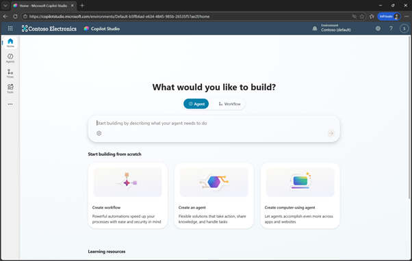
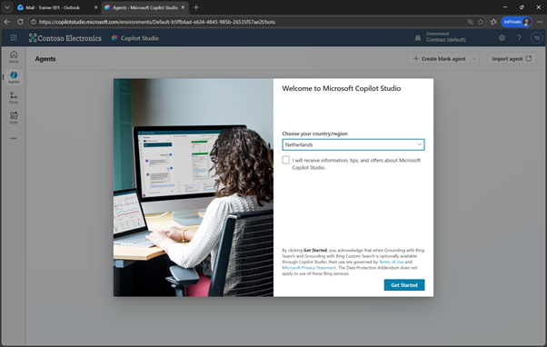
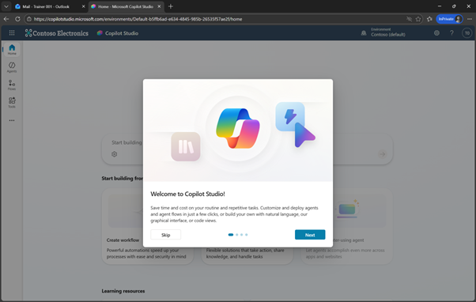
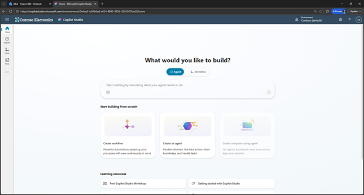
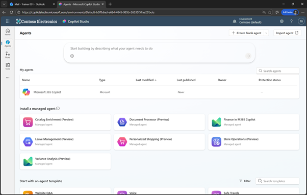
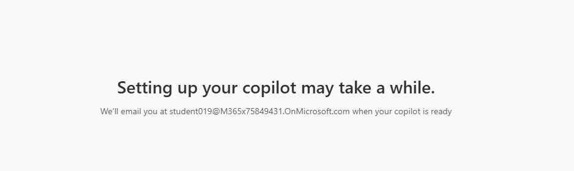
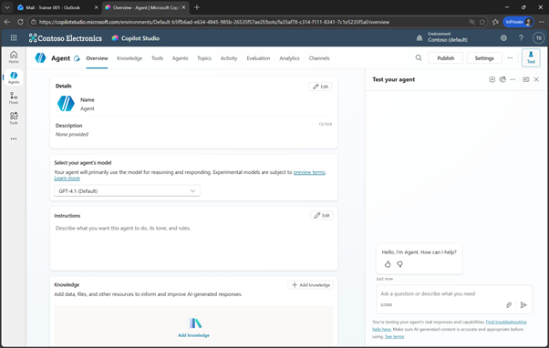
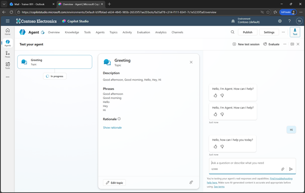

# 🔌 2. Challenge 2: First Login to Copilot Studio
[< 🤖 Quest 1](Quest1.md) - **[🔧 Quest 3 >](Quest3.md)**

In Challenge 2, we will get started with Copilot Studio. 

Copilot Studio is Microsoft’s low-code platform for building, customizing, and managing AI-powered copilots and agents. It enables organizations to create conversational assistants that understand natural language, ground responses in enterprise knowledge, and interact with users across channels like Microsoft Teams, websites, and Microsoft 365 applications.

With Copilot Studio, both business users and developers can extend Microsoft 365 Copilot or create standalone agents that automate workflows, call APIs, and integrate with enterprise systems using connectors and Power Automate. The platform provides built-in governance, security, and analytics, making it possible to scale AI agents safely and reliably across the organization.


## 2.1 Getting started with Copilot Studio and creating the first agent

### 2.1.1. Open https://copilotstudio.microsoft.com/
> [!NOTE]
> This should be done in the same Browser where you opened Outlook before. Just open another tab. 

 

### 2.1.2. Confirm the region  
 
 
### 2.1.3. Click on Skip 
 

### 2.1.4. From the Homepage select Agents on the left hand side
 

 
### 2.1.5. Click on Create blank agent
 


> [!NOTE]
> Sometime setting up Copilot Studio for the first time can take some time. Don't worry, just continue with the [next quest](Quest3.md) for now. 
>  

 

### 2.1.6. Run a first test:
Just write ```Hi``` to trigger an interaction


 

Results from your first tests:

 
 
 


# Where to next?

**[🤖 Quest 1](Quest1.md) - **[🔧 Quest 3 >](Quest3.md)**

[🔝](#)
