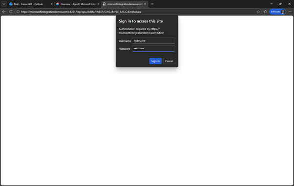
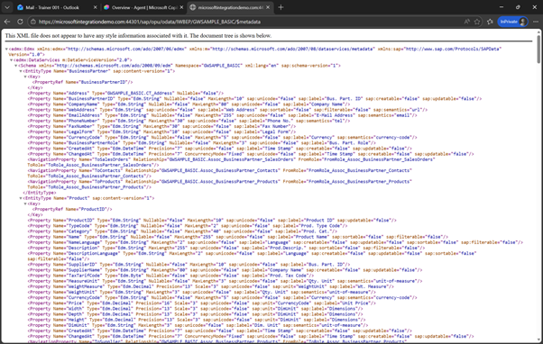
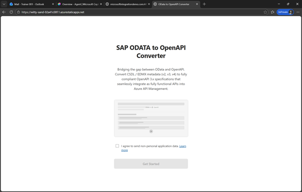
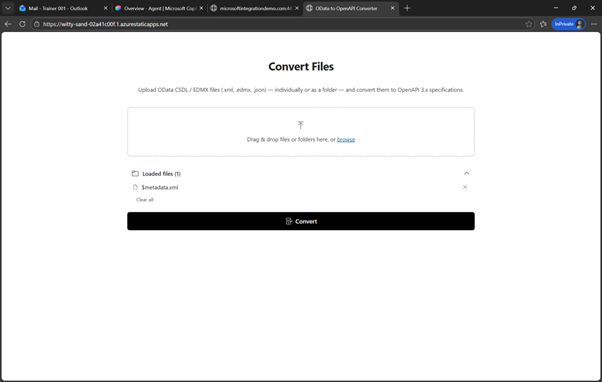
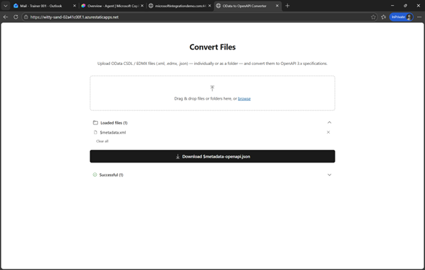

# 🔧 3. Challenge 3: Download SAP Metadata
[< 🔌 Quest 2](Quest2.md) - **[Quest 4 >](Quest4.md)**

## 3.1. Access the SAP System, connect to the OData service and convert to OpenAPI
For our tests we are going to use the GWSAMPLE Service, https://microsoftintegrationdemo.com:44301/sap/opu/odata/IWBEP/GWSAMPLE_BASIC/

The first thing is to download the $metadata information, via. https://microsoftintegrationdemo.com:44301/sap/opu/odata/IWBEP/GWSAMPLE_BASIC/$metadata

## 3.1.1. Make sure to logon with the user dsag2026 and the password provided:
 
  
## 3.1.2. Save the file by clicking Strg-S 
 
 
## 3.1.3. Now we need to convert this metadatfile in an OpenAPI Specification. 
For this we use the website https://witty-sand-02a41c00f.1.azurestaticapps.net/

Open the page, select “I agree” and click on Get started.
 
 
## 3.1.4. Select the $metadata file you downloaded before and click on Convert. If you had issues you can also use this file xxx
 
 
## 3.1.5. Download the $metadata-openapi.json file by clicking on Download
 
 

 
# Where to next?

**[🔌Quest 2](Quest2.md) - [ Quest 4 >](Quest4.md)

[🔝](#)
