# 🔧 4. Challenge 4: Manage APIs in Azure API Management
[< 🔌 Quest 3](Quest3.md)  - **[Quest 5 >](Quest5.md)**

## 4.1. Azure API Management
!!! TODO !!! What is APIM

### 4.1.1. Open Azure API Management in the Azure Portal:
https://portal.azure.com/#@tws22.onmicrosoft.com/resource/subscriptions/0973cd86-8527-4a13-a1c8-b3431c0e1fde/resourceGroups/techXChange2026-apim/providers/Microsoft.ApiManagement/service/techxchangeapim/overview


### 4.1.2. Click on accept
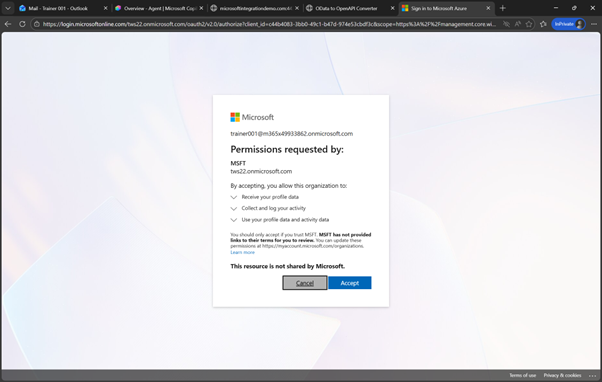 

### 4.1.3. Since this is an external user in this Azure subscription you need to add also this user to the Authentictor
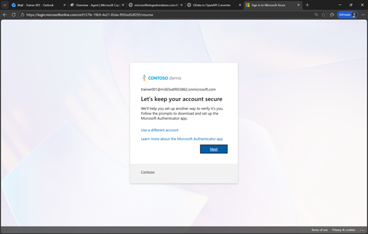 
 
### 4.1.4. As before run though the process to add the user to your Authentictor app
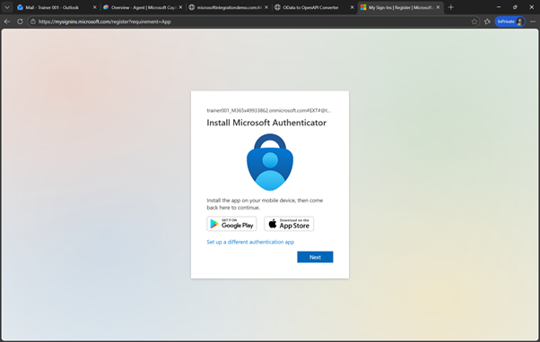 
 
 
 
 
### 4.2.1. In Azure API Management
Now you are in Azure API Management. This is one instance that is use for all participants. Please don’t delete any existing APIs and only work with your own

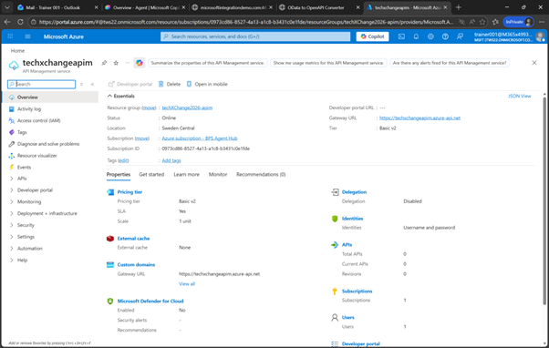 
 
### 4.2.2. Expand API and click on APIs
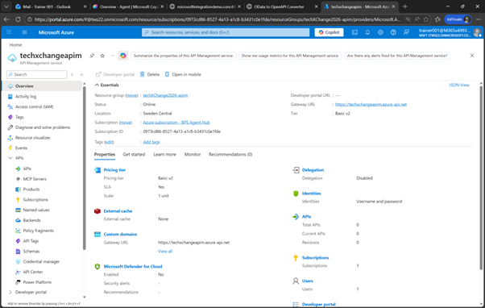 
 
### 4.2.3. Scroll down and click on OpenAPI
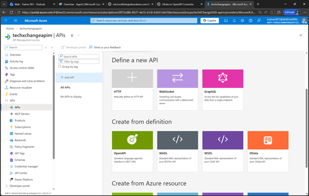 
 
### 4.2.4. Click on Select a File and select the $metadata-openapi.json file that we converted and downloaded before
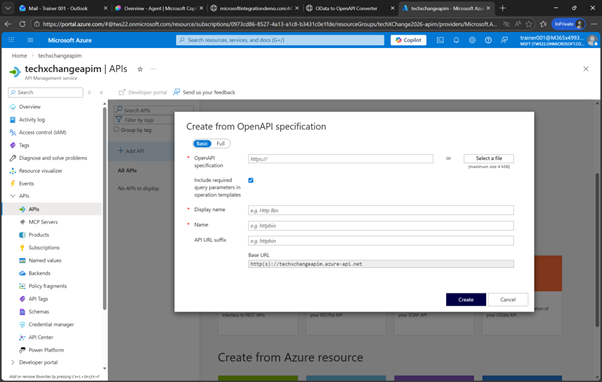 
 
 ### 4.2.5. Configure the rest
For the API URL Suffix enter your ```studenXXX``` with your student number, 

Make also sure to adjust the display name and add ```studenXXX GWSAMPLE_BASIC```  as the display name 

then click on Create

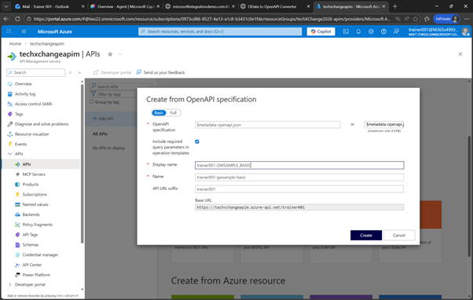 
 
From now on, please only use your API, e.g. trainer001-GWSAMPLE_BASIC
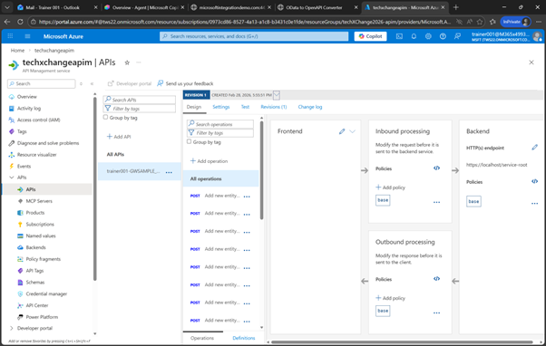 
 
### 4.3.1. Configure authentication
Next we will configure the authentication. Here you would now setup principal propagation / SSO. In our scenario we are going to do basic authentication with a username and password that is already configured as “Named values” pair. In order to use that configuration, click on the Policies Code editor

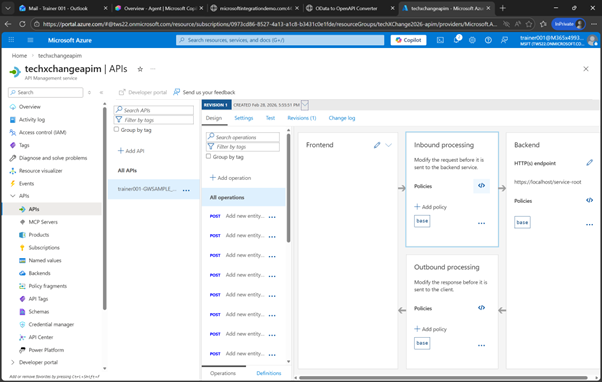 
 
### 4.3.2. Enhance the policy
 Under     
 ```xml
 <inbound> 
 <base /> 
 ```
 add the following line. This will fetch the username and password fromt he Named Value store and add it to an authorization header for each call to the backend system
````xml
<authentication-basic username="{{sap-user}}" password="{{sap-password}}" />
````

And click on Save

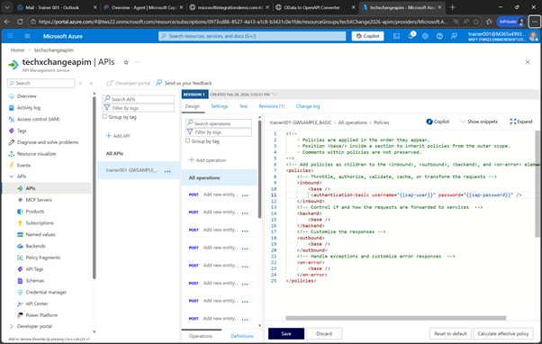 
 
### 4.4.1. Adjust the settings
Now click on Settings

 
 

### 4.4.2. Change the target URL
And change the Web Service URL to 
```https://microsoftintegrationdemo.com:44301/sap/opu/odata/IWBEP/GWSAMPLE_BASIC```
and click on Save
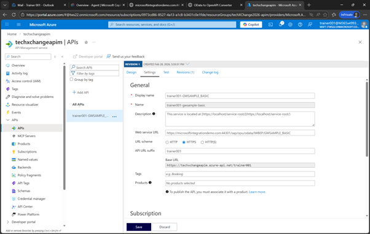 
 
### 4.4.3. Uncheck Subscription Required
On the same screen, scroll down and uncheck “Subscription required” and click on Save
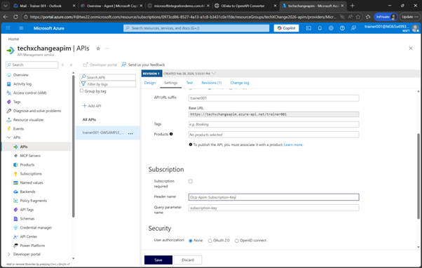 
 
### 4.5.1. Test the API
Now click on Test, select the Entity Type ```Get entities from BusinessPartnerSet``` 
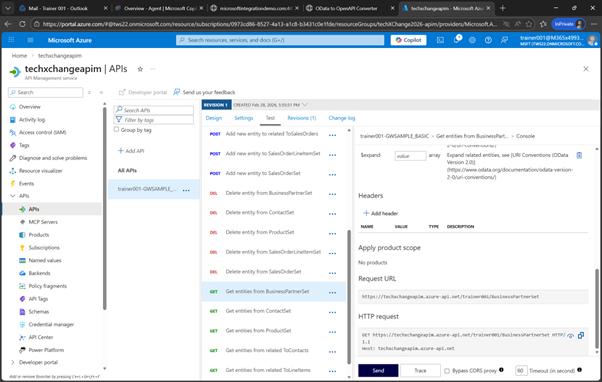 

### 4.5.2 And click on Send
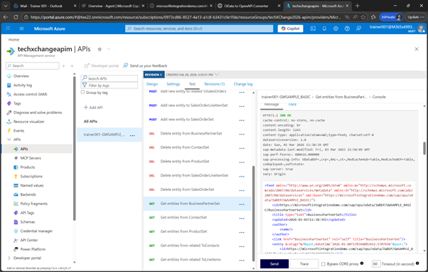 

 

# Where to next?

**[🔌Quest 3](Quest3.md) - [ Quest 5 >](Quest5.md)

[🔝](#)

