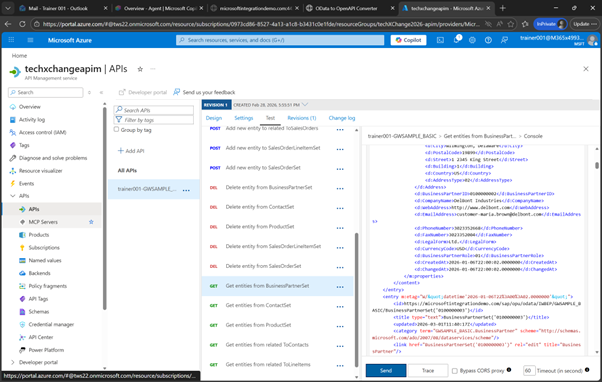
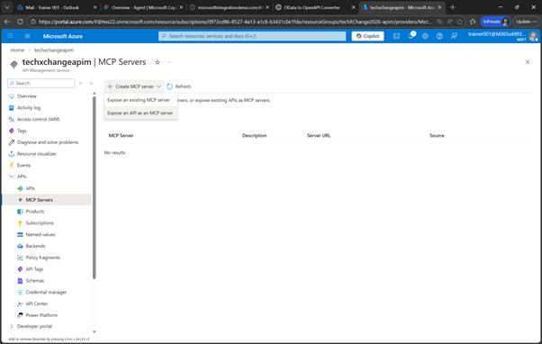
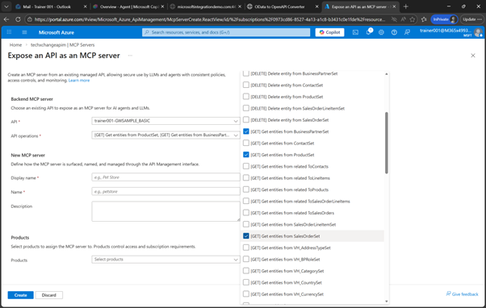
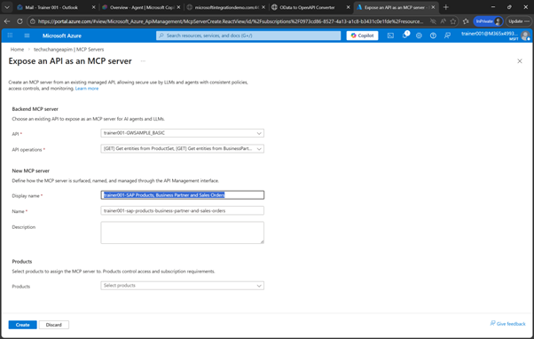
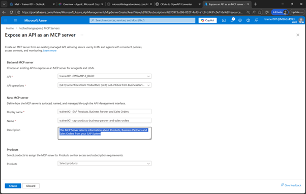
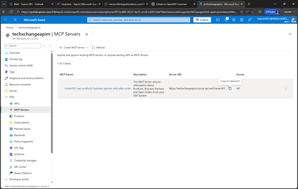

# 🔧 5. Challenge 5: Change data in SAP
[< 🔌 Quest 4](Quest4.md)  - **[Quest 6 >](Quest6.md)**
## 5.1 Create an MCP Server

## 5.1.1. Navigate to MCP 
With this API now managed in Azure APIM, we can create an MCP Server out of it. Select MCP Server on the left hand side
  

Click on Create MCP Server and select Expose an API as an MCP Server
  
 
Under API select the API that you just created, e.g. ```studenXXX-GWSAMPLE_BASIC``` 
  
 

From API Operations, select 
* Get entity from BusinessPartnerSet
* Get entity from ProductSet
* Get entity from SalesOrderSet
 
  
 
For the Display Name enter ```trainer001-SAP Products, Business Partner and Sales Orders```
  
 
As the description enter

```This MCP Server returns information about Products, Business Partners and Sales Orders from your SAP System```

and click on Create

  
 
Now your MCP Server has been created click on Copy to note down the URL of your MCP Server, 
e.g. ```https://techxchangeapim.azure-api.net/trainer001-sap-products-business-partner-and-sales-orders/mcp```
  
 


## OPTIONAL - Test via MCP Inspector
!!!TODO!!!


# Where to next?

**[🔌Quest 4](Quest4.md) - [ Quest 6 >](Quest6.md)

[🔝](#)
