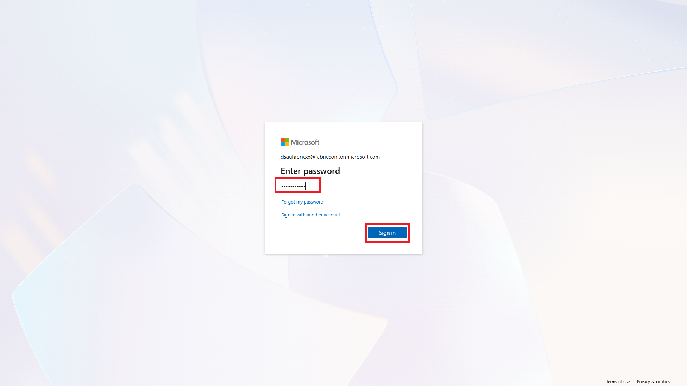
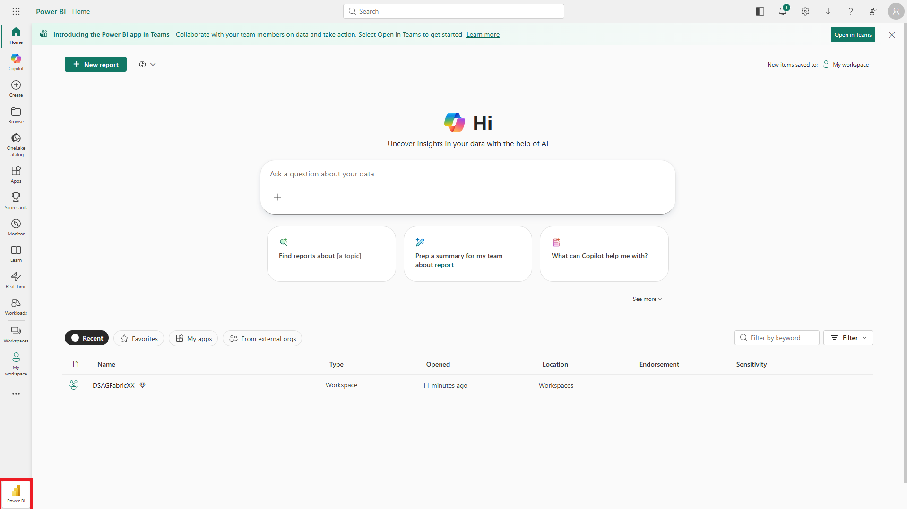
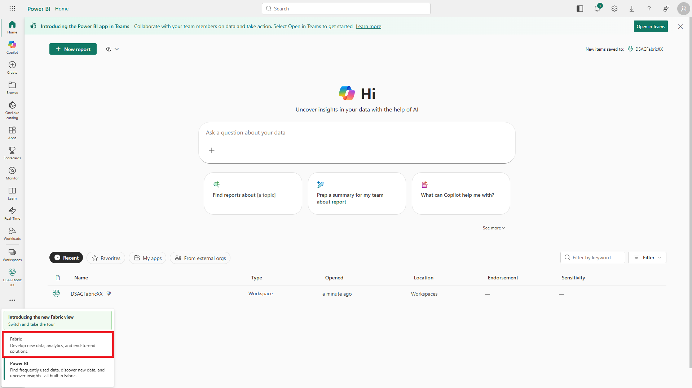
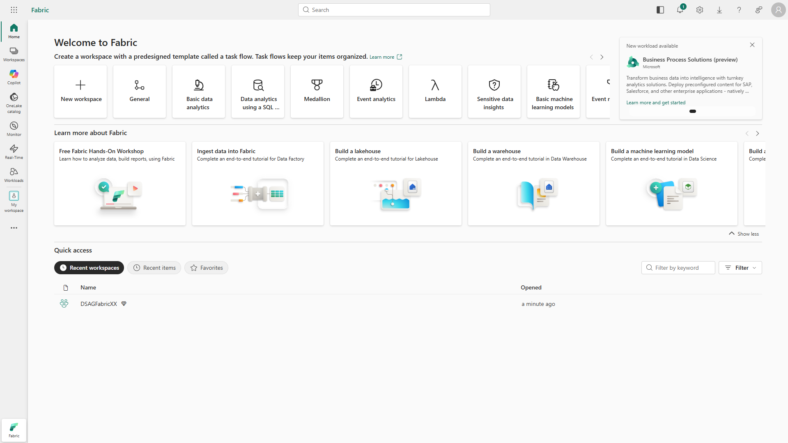
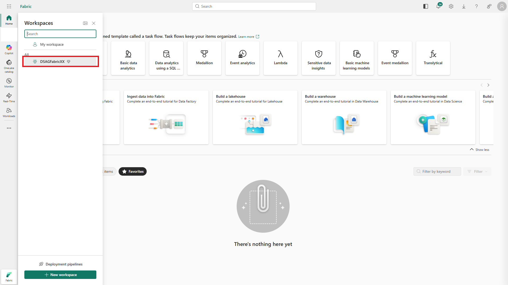
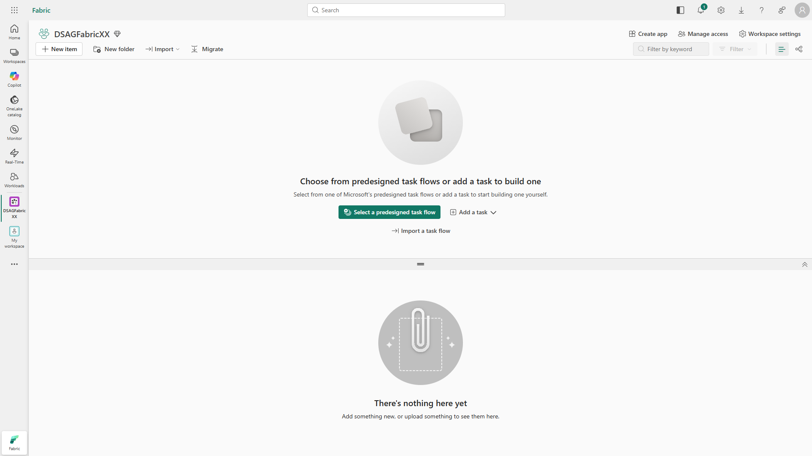

# 🤖 1. Challenge 1: Getting Started with Microsoft Fabric
[🏠Home](../README.md) - [🔌 Quest 2 >](Quest2.md)

In this section you will make yourself familiar with the very basics of Microsoft Fabric. We configured an environment, ready to use for you.
Let's log on and do the first steps!

## 1.1. Launch Microsoft Fabric:
Click on (https://app.powerbi.com) to lauch Microsoft Fabric

## 1.2. You have been assigned a user name ranging from "DSAGFabric1@fabricconf.onmicrosoft.com" to "DSAGFabric15@fabricconf.onmicrosoft.com" depending on your seat/group number. Enter the user name.

## 1.3. Enter the provided password "Initial1234":

 
## 1.4. Fabric start screen
This is Microsoft Fabric's start screen. At the bottom left, you see the Power BI icon indicating we are using the view optimized for users focussing on Power BI. Since we want to use a number of Fabric capabilities, let's switch to the Fabric view by clicking on the Power BI icon at the bottom left.

 
## 1.5. Switch to Fabric view
Now select the Fabric view.

 
## 1.6. Fabric view

 
## 1.7. Navigate to workspace
Each user works in a dedicated workspace with the same name as your user name. We have set up permissions such that you can't see other user's workspaces. Navigate to your workspace.

 
## 1.8. You're there!

# Where to next?

**[🏠Home](../README.md)** - [🔌 Quest 2 >](Quest2.md)

[🔝](#)
