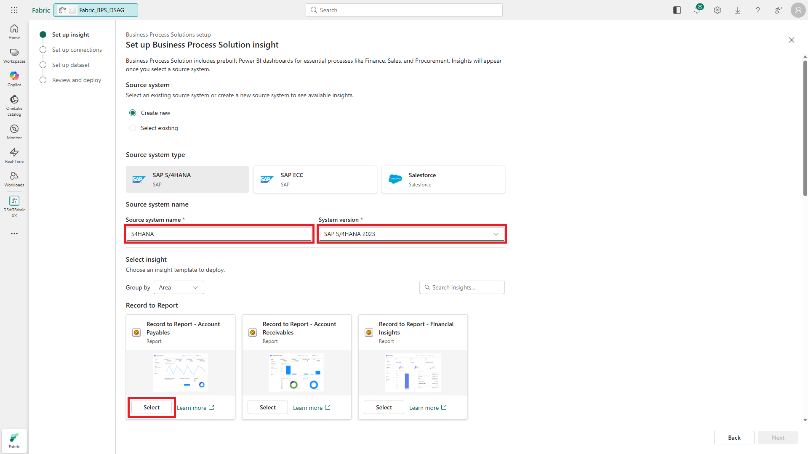
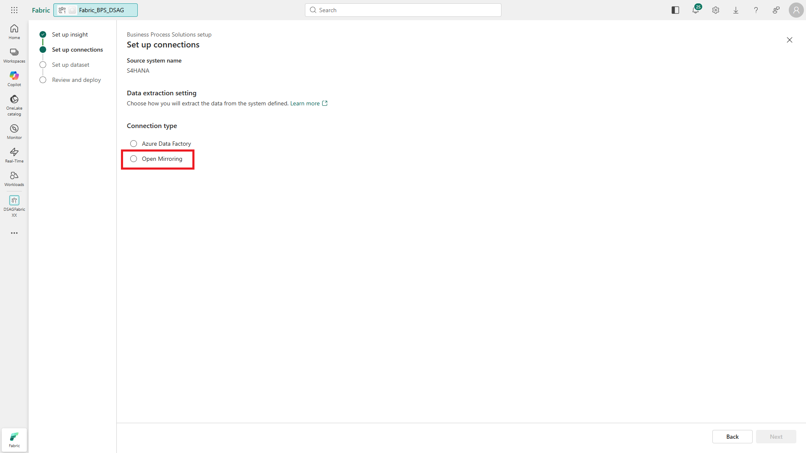
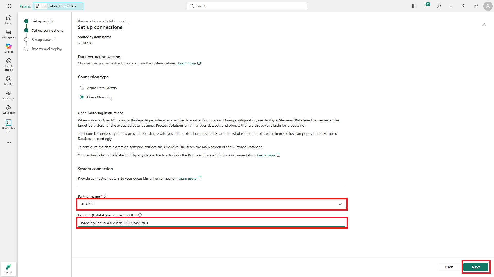

# 🔌 2. Challenge 2: Configure Microsoft Business Process Solutions
[< 🤖 Quest 1](Quest1.md) - **[🔧 Quest 3 >](Quest3.md)**

In Challenge 2, we will deploy and configure Microsoft Business Process solutions, a Microsoft Fabric workload that provides end-to-end analytic scenarios for standard use cases with SAP, Salesforce, and - in future - Microsoft Dynamics, Oracle and ServiceNow.
Business Process Solutions (BSP) covers a variety of use cases in finance, sales, procurement, material management, and more from data integration up to standard dashboards and AI agents.

We will now deploy one specific BSP scenario - account payables - and adjust it to work support Mirroring for SAP via SAP Datasphere (https://learn.microsoft.com/en-us/fabric/mirroring/sap-datasphere-tutorial) as data integration option.

Let's get started!

## 2.1. Create a Business Process Solutions item in you workspace

To start the configuration of Business Process Solutions, click on the "new item" icon in your workspace. Then select the "Business Process Solutions (preview)" icon. To find it, you may want to use "Filter by keyword".


## 2.2. Provide name

Provide a name and a description for your Business Process Solution item.


## 2.3. Start configuration

Click "get started" to start the configuration of Business Process Solutions.


## 2.4. Select source system type

We will use an SAP S/4HANA 2023 (on-premises) system as data source. Select source system type "SAP S/4HANA".


## 2.5. Assign source system name and version

Assign a sources system name and select system version "SAP S/4HANA 2023". Select the "Account Payables" insight.



## 2.6. Rename BPS insight

Scroll to the bottom of the page and change the insight name to ```R2R_Account_Payables```. Click "Next".


## 2.7. Select Open Mirroring

Currently, BPS supports Azure Data Factory as well as a number of Open Mirroring (https://learn.microsoft.com/en-us/fabric/mirroring/open-mirroring-partners-ecosystem) options for data integration.
We will chose the "Open Mirroring" option, and adjust it for SAP Datasphere premium outbound integration replication flows.

> [!NOTE]
> Out-of-the-box support for SAP Datasphere is part of the backlog for the Microsoft Business Process Solutions team. What out for an official announcement on this option.



## 2.8. Select Open Mirroring partner and connection

Select any Open Mirroring partner option from the drop-down menu. Your choice does not matter because we will be using SAP Datasphere in this exercise.
Select connection id ```b4ec5ea8-ae2b-4922-b3b9-5608a4993f61```.



## 2.9. Adjust insight name

Change the insight name to ```R2R_Account_Payables_Insight```.


## 2.10. Deploy

Deploy your configuration. This will create a number of pipelines, python notebooks, semantic models and dashboards into your workspace.


## 2.11. Successful configuration

Deployment can take a few minutes. Instead of waiting, you can continue with the next quest and check for successful deployment in the notifications.


# Where to next?

**[🤖 Quest 1](Quest1.md) - [🔧 Quest 3 >](Quest3.md)

[🔝](#)
