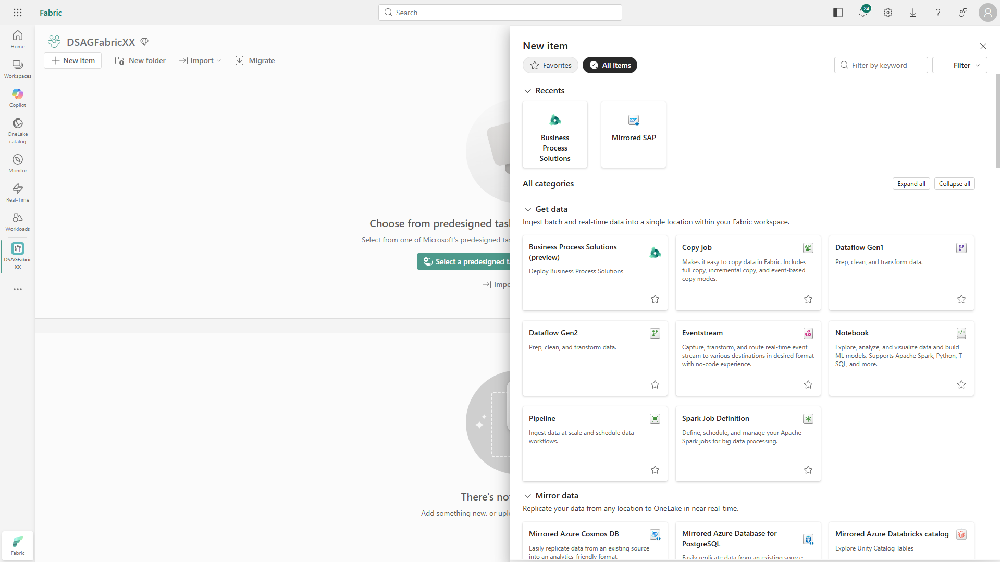
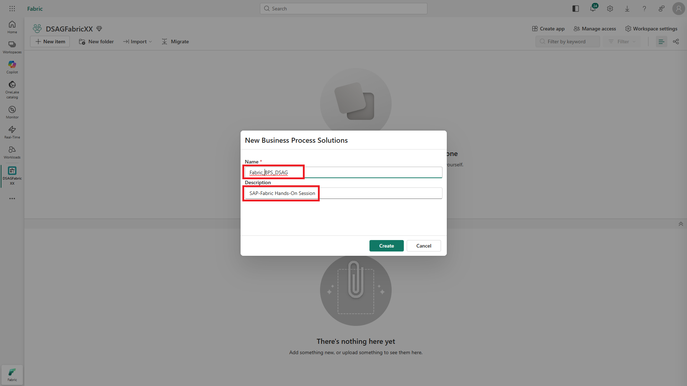
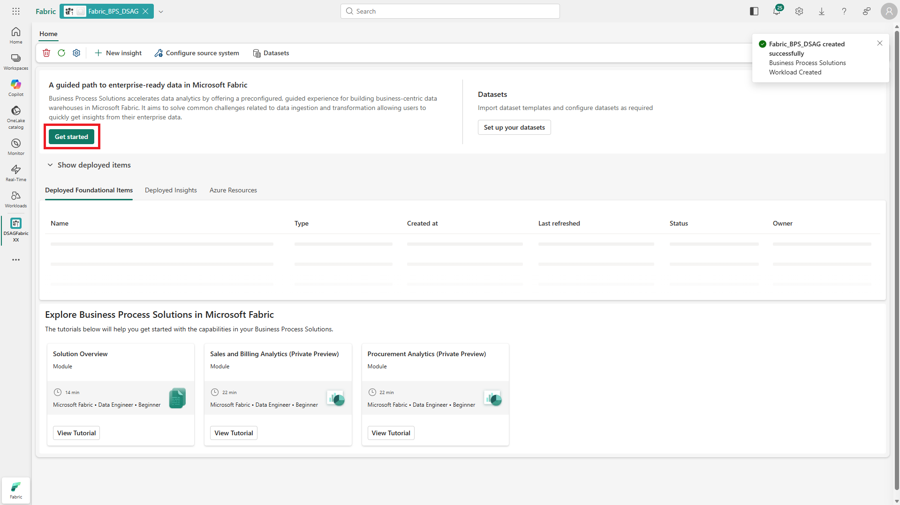
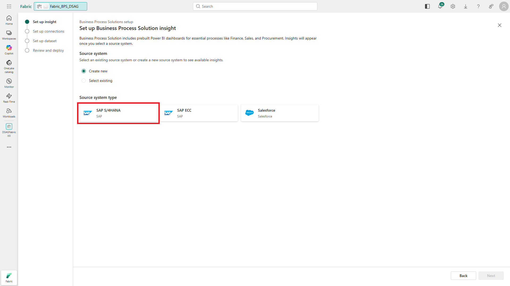
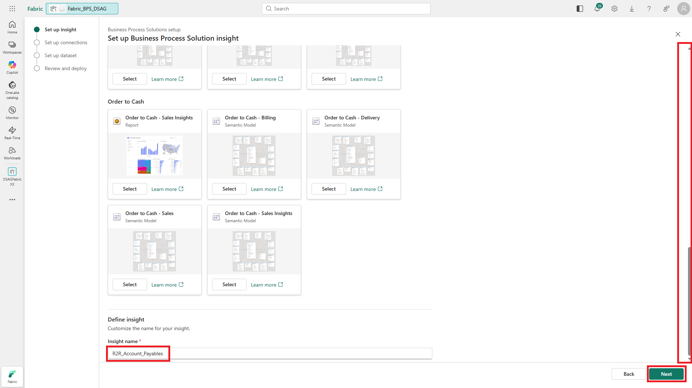
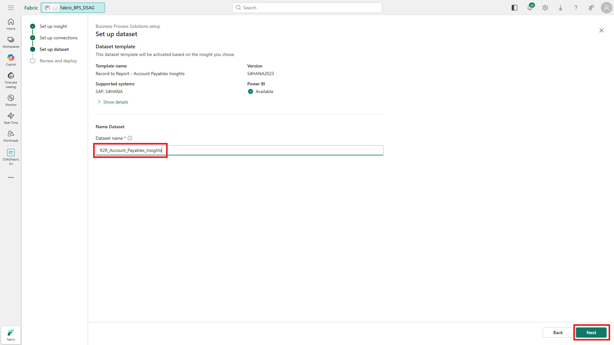
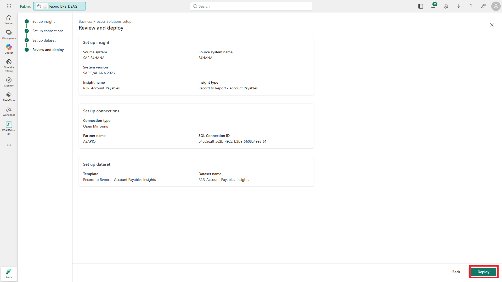
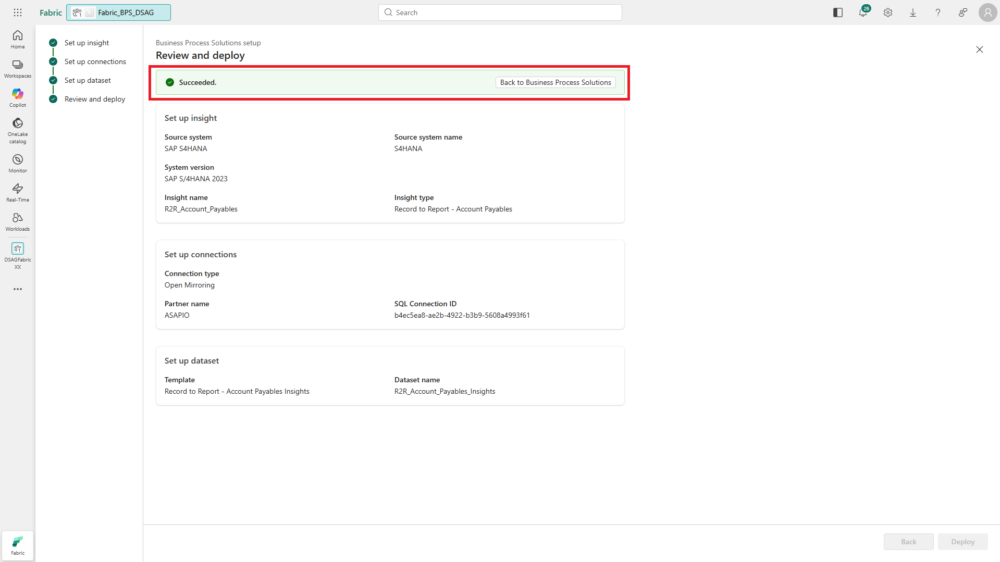

# 🔌 2. Challenge 2: First Login to Copilot Studio
[< 🤖 Quest 1](Quest1.md) - **[🔧 Quest 3 >](Quest3.md)**

In Challenge 2, we will deploy and configure Microsoft Business Process solutions, ...

## 2.1. Create a Business Process Solutions item in you workspace

To start the configuration of Business Process Solutions, click on the "new item" icon in your workspace. Then select the "Business Process Solutions (preview)" icon. To find it, you may want to use "Filter by keyword".

## 2.2.

## 2.3.

## 2.4.

## 2.5.

Select the "Account Payables" insight.

## 2.6.

## 2.7.

.png)

## 2.8.

## 2.9.

## 2.10.

# Where to next?

**[🤖 Quest 1](Quest1.md) - [🔧 Quest 3 >](Quest3.md)

[🔝](#)
