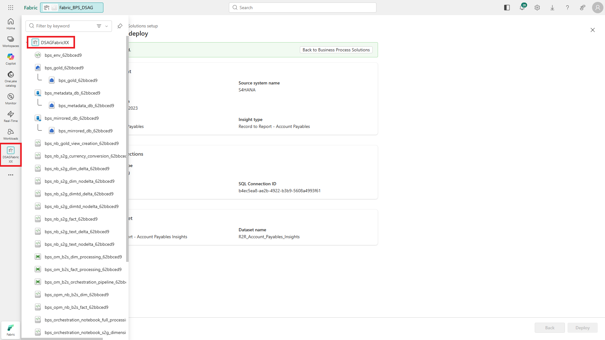
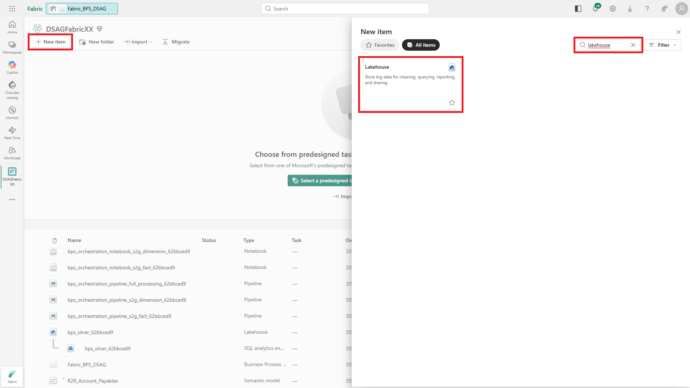
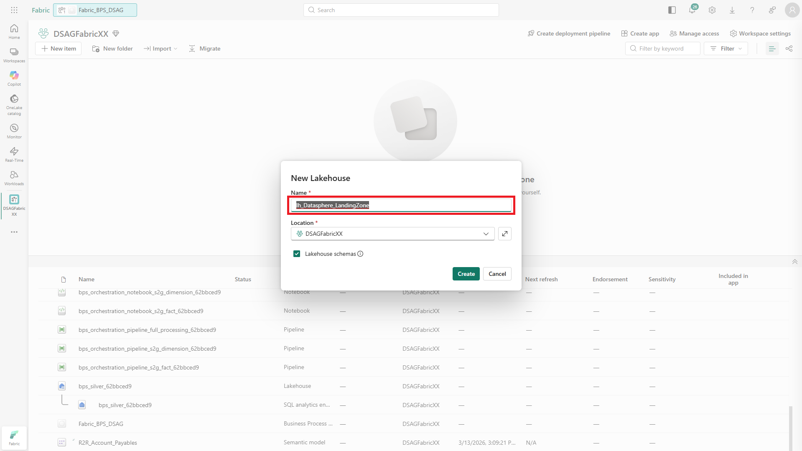
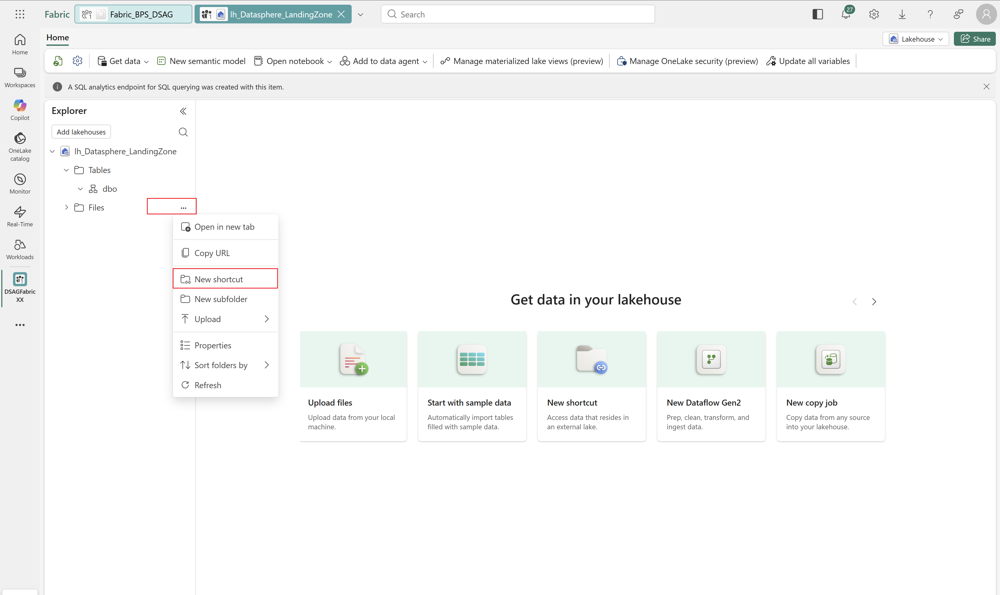
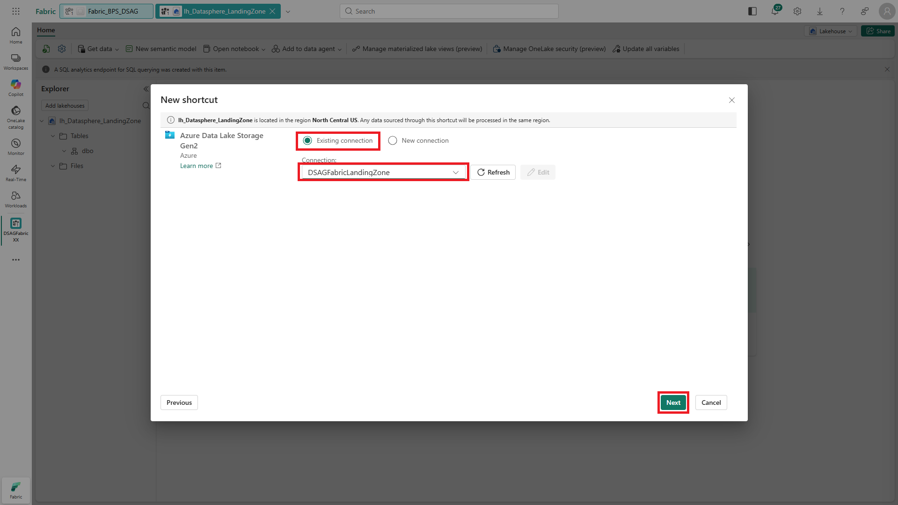
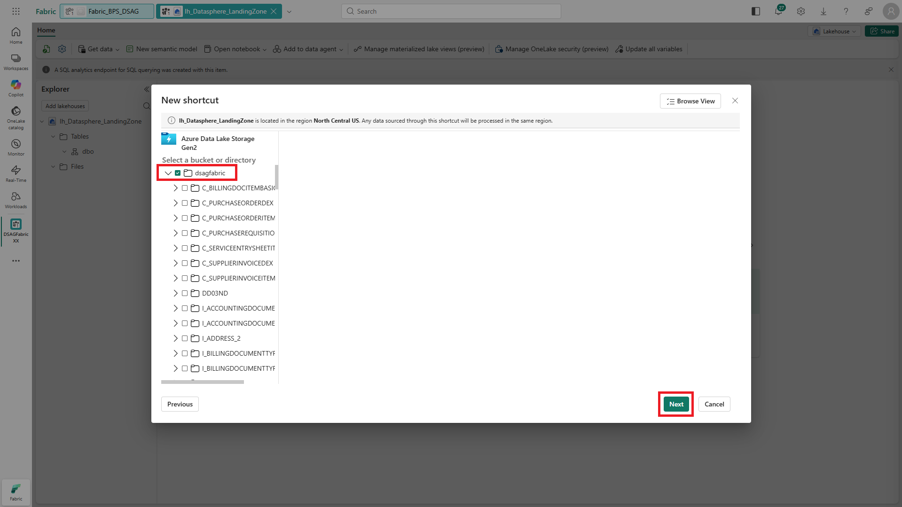
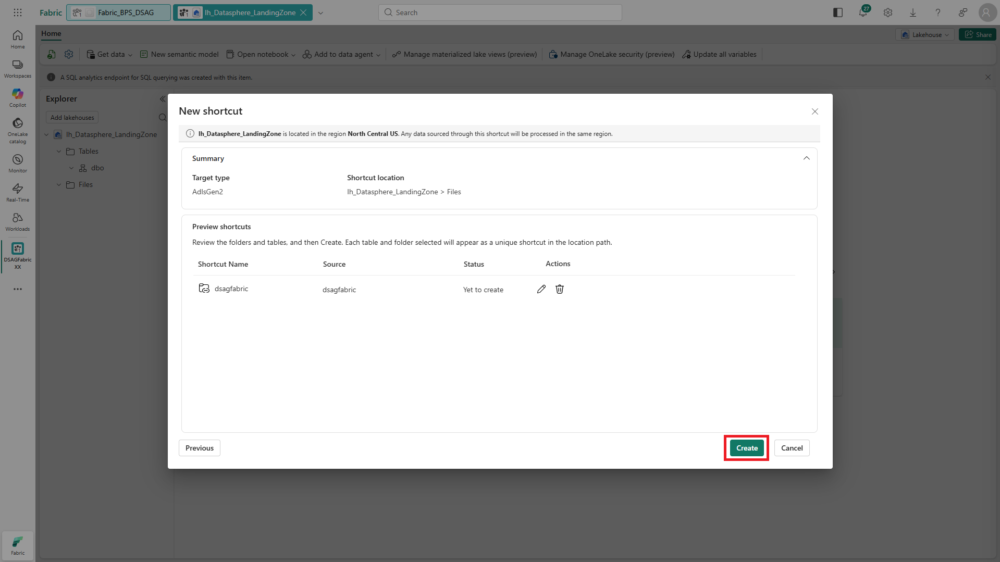
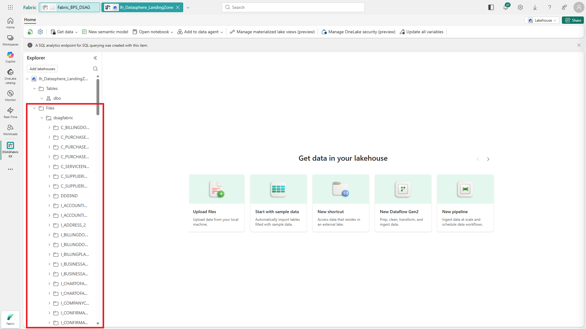

# 🔌 2. Challenge 3: Create Shortcut to SAP data
[< 🤖 Quest 2](Quest2.md) - **[🔧 Quest 4 >](Quest4.md)**

SAP Datasphere premium outbound integation replication flows can write (initial) snapshots and incremental/delta data as parquet files into Azure Data Lake Gen2. We have already prepared a set of SAP S/4HANA data for this exercise in a storage container.

In quest 3, we will create a shortcut to connect to the data replicated by SAP Datasphere. In the following quest, we will use Fabric's **mirror engine** to merge the data written by SAP Datasphere into a mirrored database (https://learn.microsoft.com/en-us/fabric/mirroring/sap).

## 3.1. Navigate to workspace

Navigate back to your workspace.

## 3.2. Create Lakehouse in Fabric OneLake

Shortcuts - which integrate seemlessly integrate data from external data lakes like ADLS Gen2, Amazon S3 or Google GCS into Fabric OneLake without data replication - are part of Fabric Lakehouses. In order to connect to the ADLS Gen2 storage container with our SAP S/4HANA data, let's first create a Lakehouse.

## 3.3. Assign name

Assign a name to your Lakehouse.

## 3.4. Create new shortcut

From the "Files" folder of your lakehouse, create a new shortcut.

## 3.5 Select shortcut type

Select source type Azure Data Lake Storage Gen2.

## 3.5. Select connection

We have already set up a connection to the ADLS Gen2 storage container and shared it with your user. Select it for your shortcut.

## 3.6. Select storage container

You can now see the folder structure of the storage container with SAP S/4HANA data. Select the storage container and click "Next".

## 3.7. Create Shortcut

Click "Create" to finish the shortcut configuration.

## 3.8. Inspect SAP data

In your Lakehouse, you can now inspect the SAP data. Feel free to take a look at the folder structure and contents.

# Where to next?

**[🤖 Quest 2](Quest2.md) - [🔧 Quest 4 >](Quest4.md)

[🔝](#)
