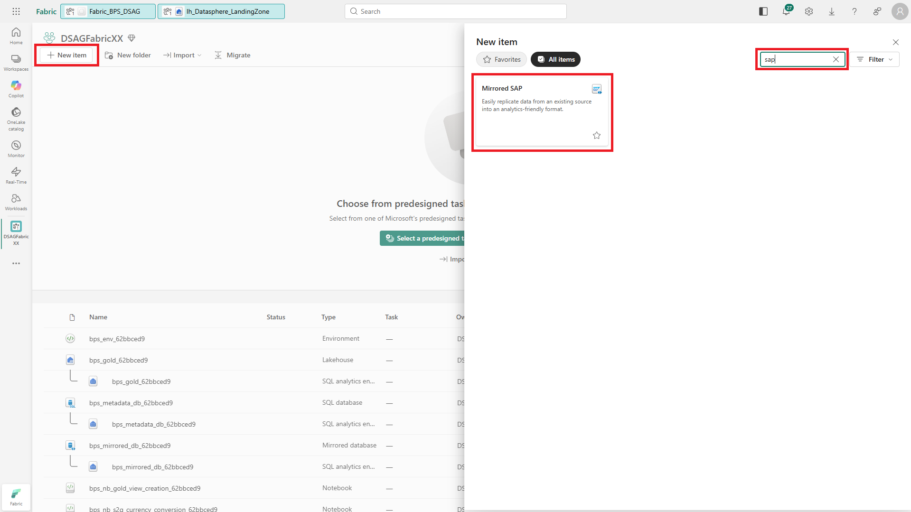
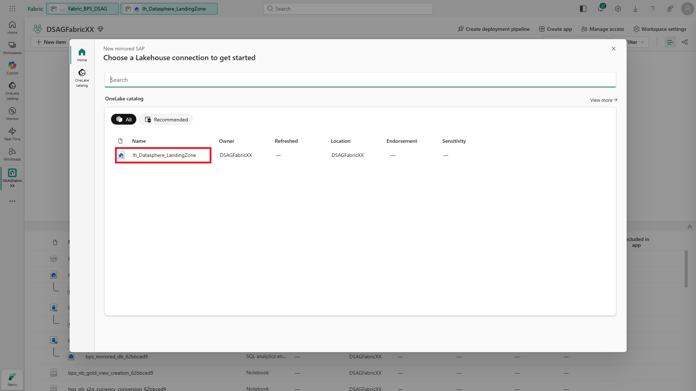
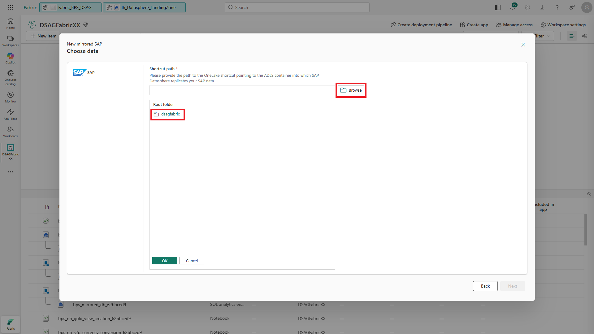
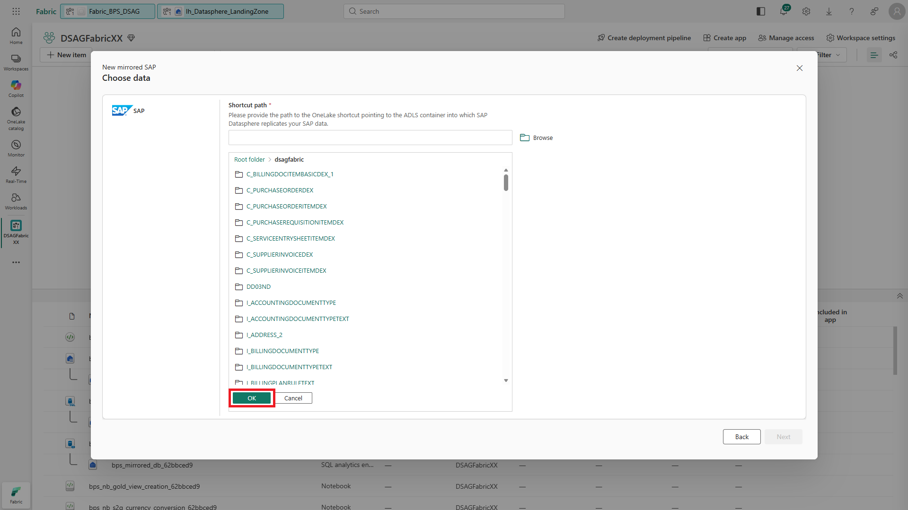
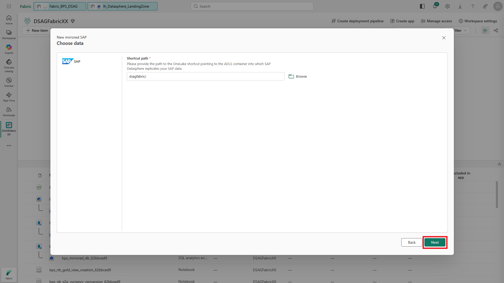
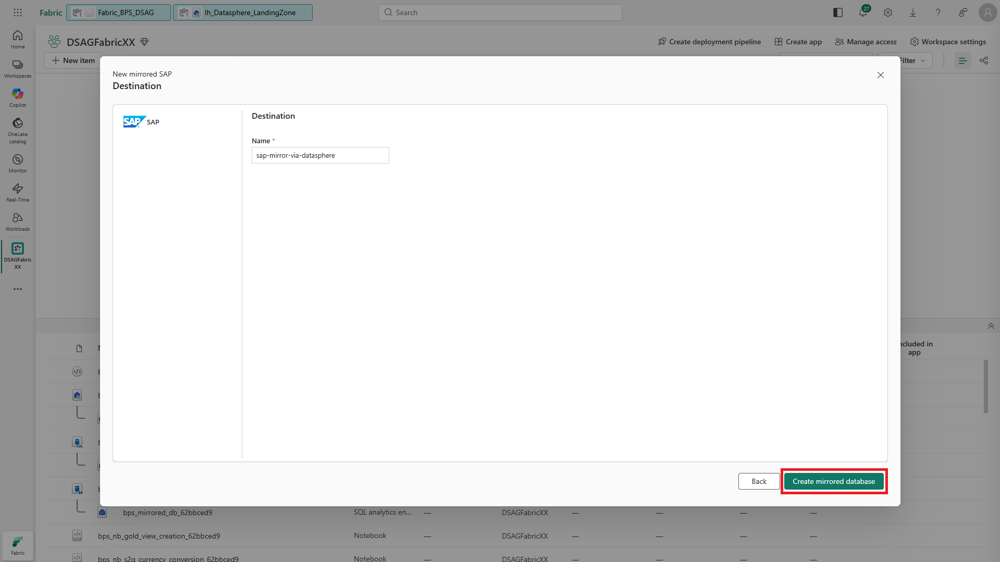
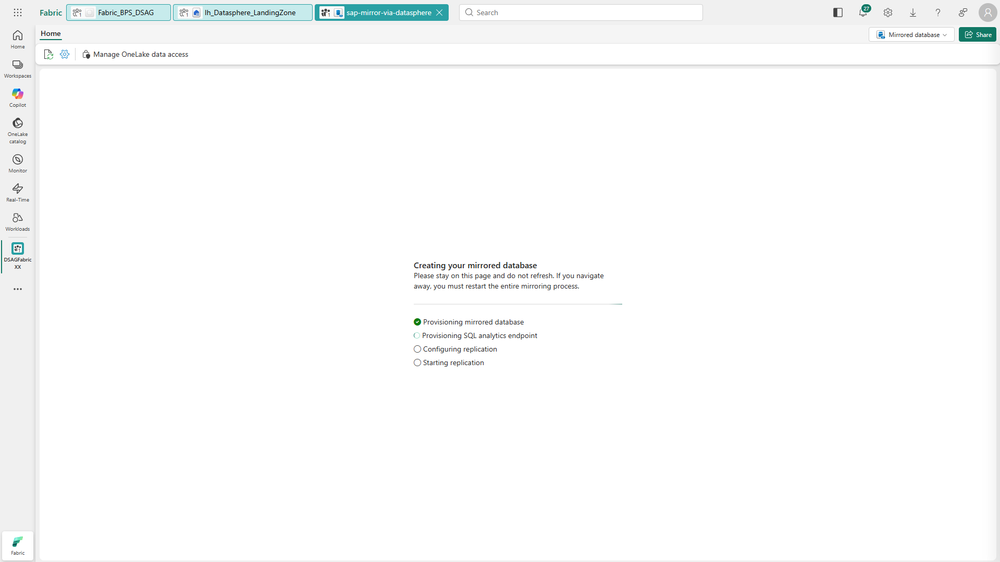
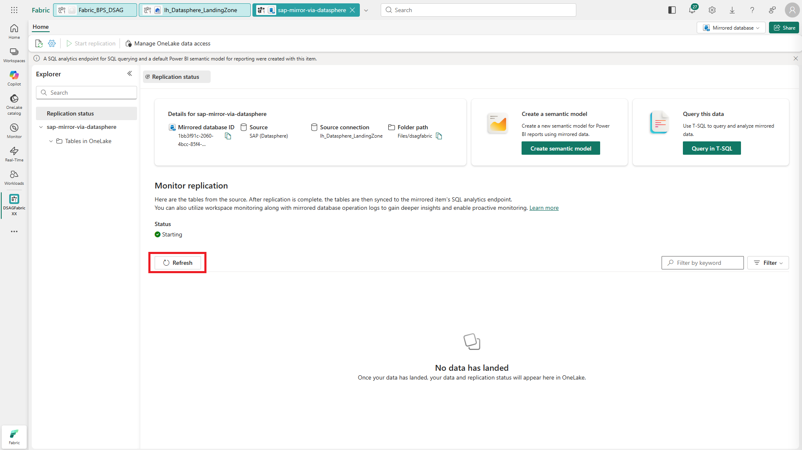
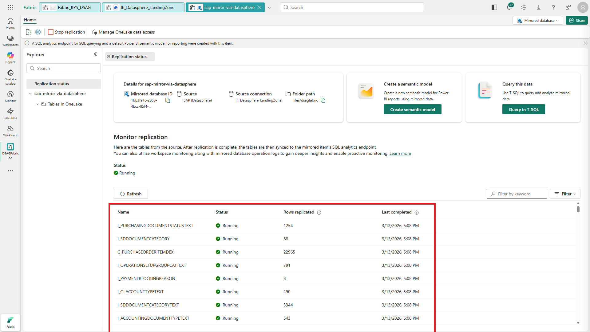

# 🔌 4. Challenge 4: Create Shortcut to SAP data
[< 🤖 Quest 3](Quest3.md) - **[🔧 Quest 5 >](Quest5.md)**

In Challenge 4, we will mirror the SAP Account Payables data into Microsoft Fabric...

## 4.1. Create a new "mirrored SAP" item in you workspace

Navigate back to your workspace

## 4.2.

## 4.3.

## 4.4.

## 4.5.

Select the "Account Payables" insight.

## 4.6.

## 4.7.

## 4.8.

## 4.9.

## 4.10.

# Where to next?

**[🤖 Quest 2](Quest2.md) - [🔧 Quest 4 >](Quest4.md)

[🔝](#)
