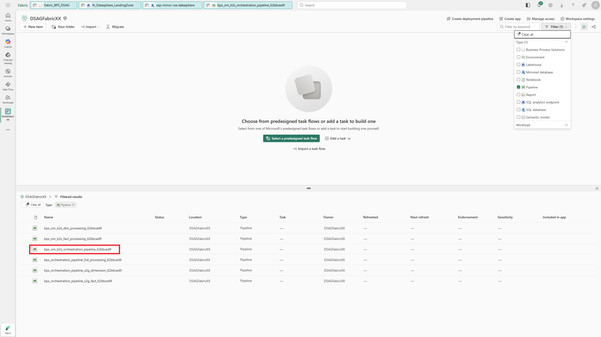
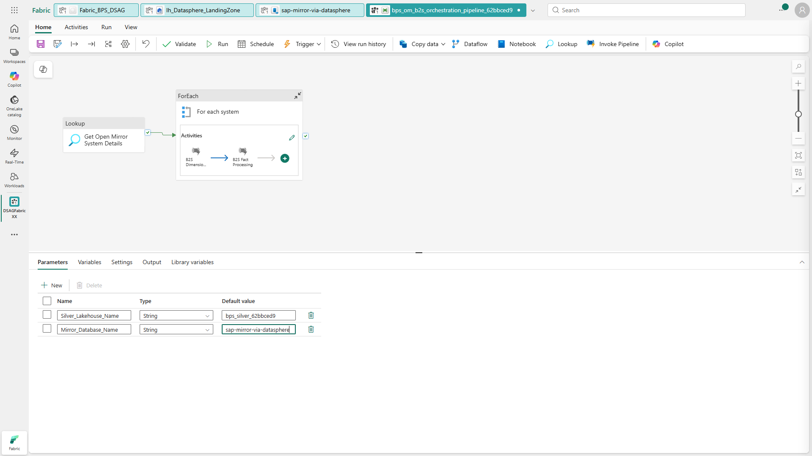
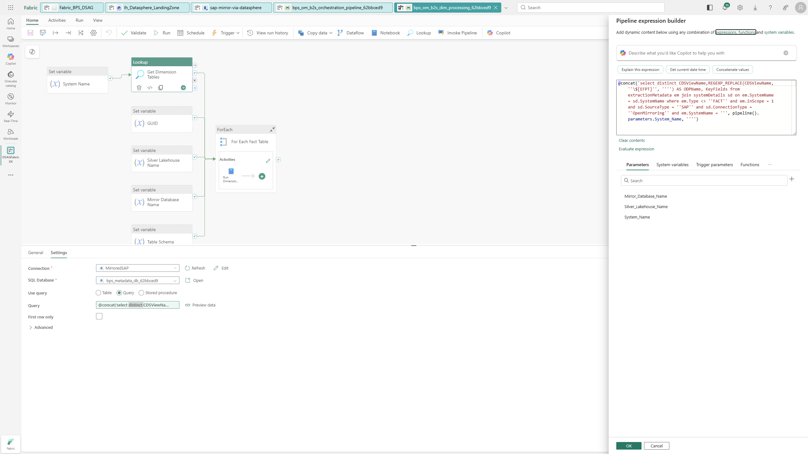

# 🔌 5. Challenge 5: Adjust pipelines
[< 🤖 Quest 4](Quest4.md) - **[🔧 Quest 6 >](Quest6.md)**

Microsoft Business Process Solutions does not yet support mirored SAP databases as a source out of the box. However, with a few adjustments, we can make it work. In the following three challenges, we will adjust the pipelines and notebooks provided by Business Process Solutions to get things running.

## 5.1. Navigate to the workspace


## 5.2. Adjust bronze-to-silver orchestration pipeline

In your worksapce, locate the orchestration pipeline for data processing from silver to gold layer: ```bps_om_b2s_orchestration_pipeline_***```



Open the pipeline and replace the default value of parameter ```Mirror_Database_Name``` with ```sap-mirror-via-datasphere```.



Don't forget to save the pipeline!

## 5.3. Adjust bronze-to-silver pipeline for dimensions

Locate and open pipeline ```bps_om_b2s_dim_processing_***``` which orchestrates processing of dimension and text data from bronze to silver layer. Click on Lookup activity ```Get Dimension Tables``` and switch to the **Settings** tab.
Double click on the **Query** property.



Replace the given SQL code with the following snippet:

```SQL
@concat('select distinct CDSViewName,REGEXP_REPLACE(CDSViewName, ''\$[EFPT]'', '''') AS ODPName, KeyFields from extractionMetadata em join systemDetails sd on em.SystemName = sd.SystemName where em.Type <> ''FACT'' and em.inScope = 1 and sd.SourceType = ''SAP'' and sd.ConnectionType = ''OpenMirroring'' and em.SystemName = ''', pipeline().parameters.System_Name, '''')
```

Don't forget to save the pipeline!

## 5.4. Adjust bronze-to-silver pipeline for facts

Apply the same change as in 5.3 to pipeline ```bps_om_b2s_fact_processing_***```.

# Where to next?

**[🤖 Quest 4](Quest4.md) - [🔧 Quest 6 >](Quest6.md)

[🔝](#)
