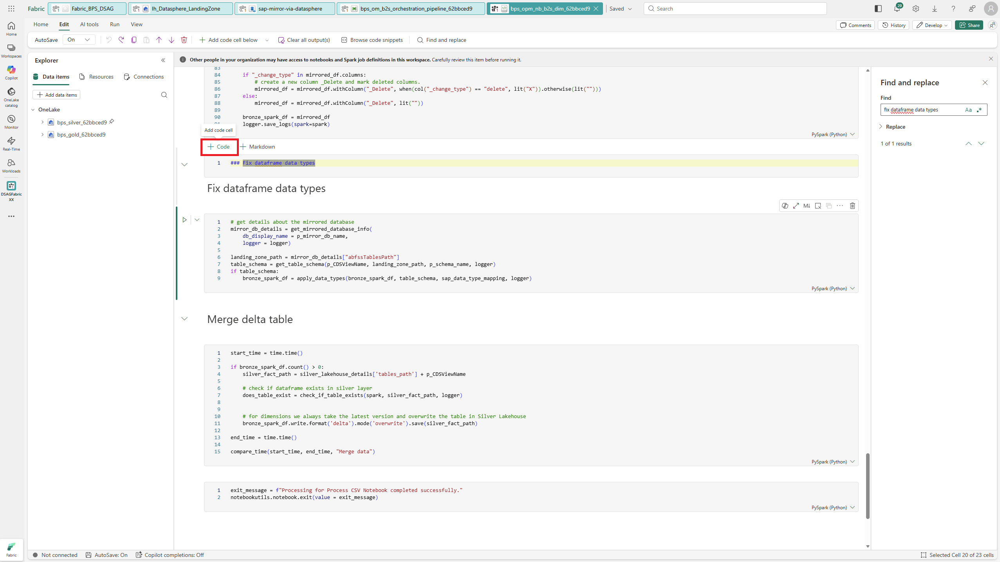
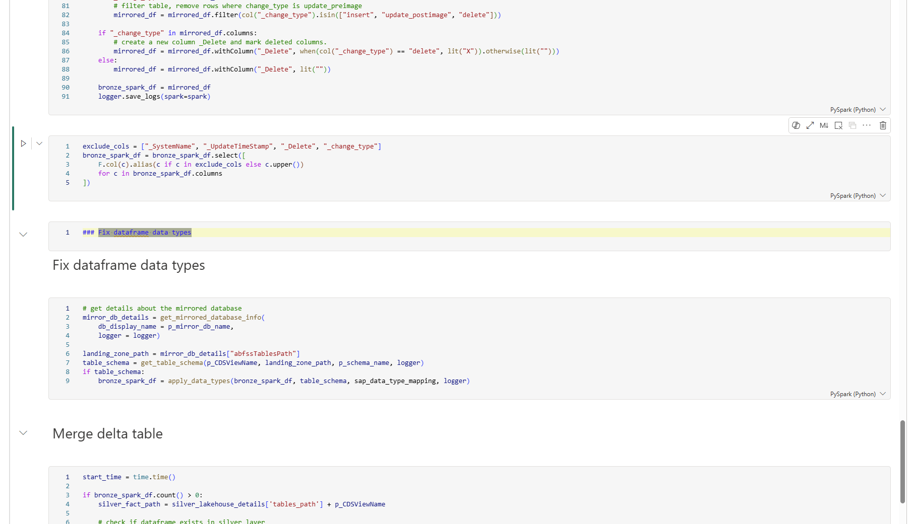

# 🔌 7. Challenge 7: Adjust fact processing
[< 🤖 Quest 6](Quest6.md) - **[🔧 Quest 8 >](Quest8.md)**

Microsoft Business Process Solutions uses Python notebooks for data transformations. In this challenge, we will make the necessary adjustments to process fact data.  
The adjustments are the same as for dimensions - except that language handling is not necessary.

## 7.1. Navigate to the workspace and locate notebook ```bps_opm_nb_b2s_dim_***```

You don't need help for this anymore ;)

## 7.2. Adjust bronze-to-silver notebook for dimensions

Notebook ```bps_opm_nb_b2s_dim_*** ``` handles transformation of dimenension and text data from bronze to silver layer. To support data in the format delivered by SAP Datasphere, we need to make some adjustments to this notebook.

### 7.2.1. Adjust function ```apply_data_types```

SAP Datasphere formats date columns in a slightly different way than the supported Open Mirroring solutions do. Let's adjust the code to take care of that:

Open notebook ```bps_opm_nb_b2s_dim_*** ``` and find function ```apply_data_types```. After line 28, insert to following code snippet

```python
            if field['dataType'] == 'DATS':
                input_df = input_df.withColumn(column_name, F.to_date(input_df[column_name], "yyyyMMdd"))
```

The function should now read as follows:

```python
def apply_data_types(
    input_df,
    table_metadata,
    sap_data_type_mapping,
    logger):

    # load schema into object
    schema_list = table_metadata
    # get columns for input_df
    col_set = set(input_df.columns)

    fields = {}
    # Use a for loop to create StructField objects
    for field in schema_list:
        field = json.loads(field)
        column_name = field['fieldName']
        if field['dataType'] in sap_data_type_mapping:
            data_type = sap_data_type_mapping[field['dataType']]

            # if datatype is decimal, fix the length and decimal fields
            if isinstance(data_type, DecimalType):
                data_type = DecimalType(field['length'], field['decimals'])
        else:
            data_type = StringType()

        if column_name in col_set and data_type != StringType():
            if field['dataType'] == 'NUMC':
                input_df = input_df.withColumn(column_name, F.when(F.col(column_name) == "00000000", F.lit(None)).otherwise(F.col(column_name)))
            if field['dataType'] == 'DATS':
                input_df = input_df.withColumn(column_name, F.to_date(input_df[column_name], "yyyyMMdd"))
            logger.debug(f"Casting column {column_name} to data type {data_type}")
            input_df = input_df.withColumn(column_name, input_df[column_name].cast(data_type))
    return input_df
```
### 7.2.2. Convert column names to upper case

SAP Datasphere generates column names in camel case, while higer layers in Business Process Solutions require them in upper case. Let's fix this!
Still in notebook ```bps_opm_nb_b2s_dim_*** ``` , search for ```fix dataframe data types```.

Create a new code cell right above the "Fix dataframe data types" snippet.



Insert the following code into the new cell:

```python
exclude_cols = ["_SystemName", "_UpdateTimeStamp", "_Delete", "_change_type"]
bronze_spark_df = bronze_spark_df.select([
    F.col(c).alias(c if c in exclude_cols else c.upper())
    for c in bronze_spark_df.columns
])
```

Your code should now look like this:



# Where to next?

**[🤖 Quest 6](Quest6.md) - [🔧 Quest 8 >](Quest8.md)

[🔝](#)
