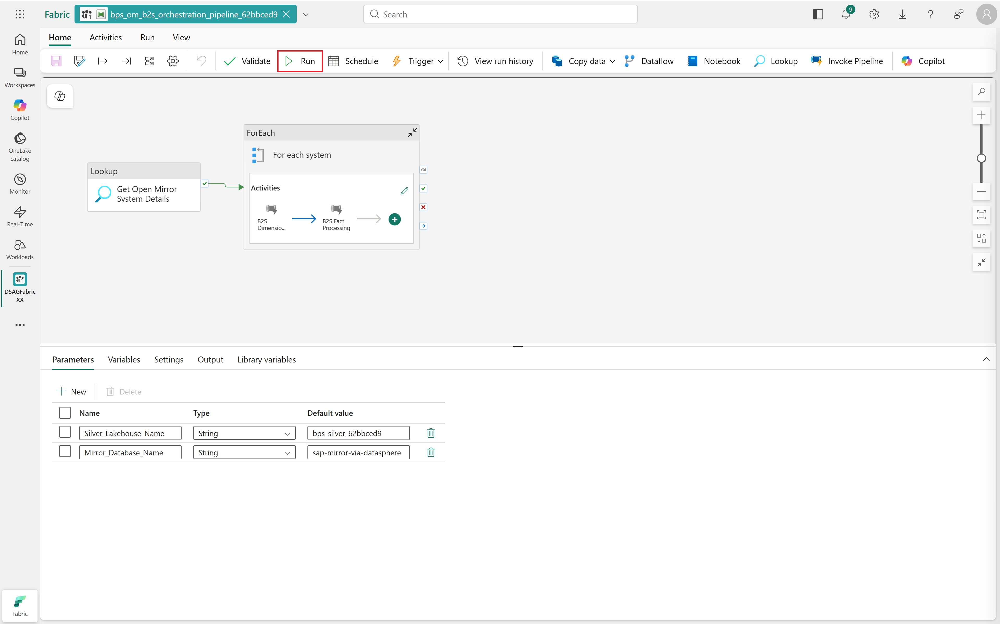
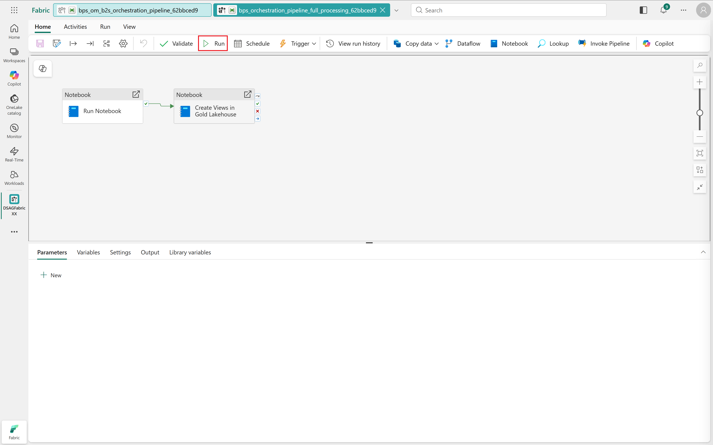
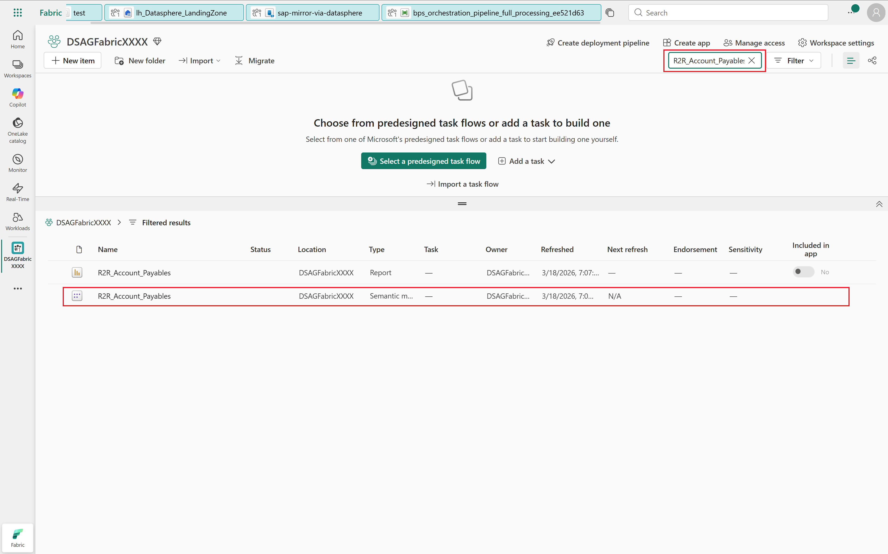
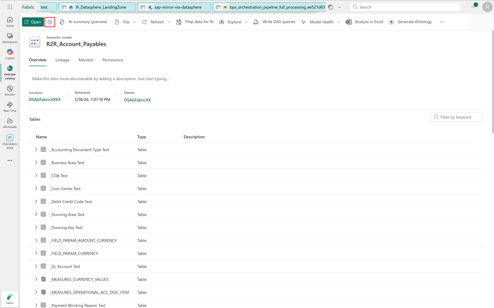
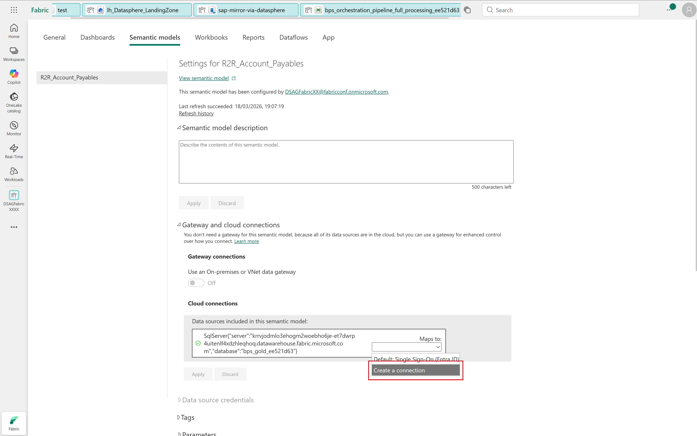
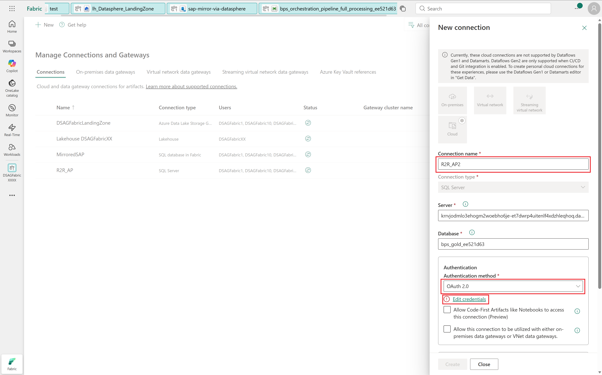
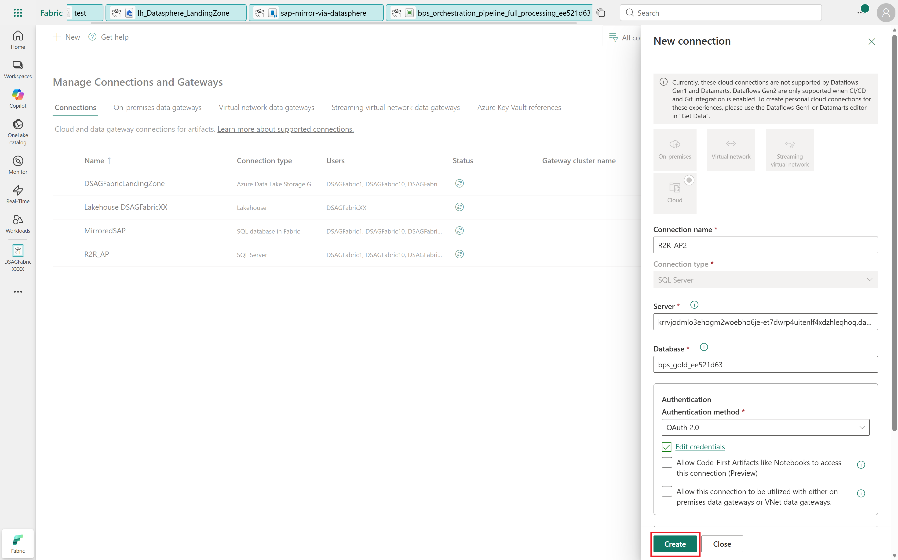
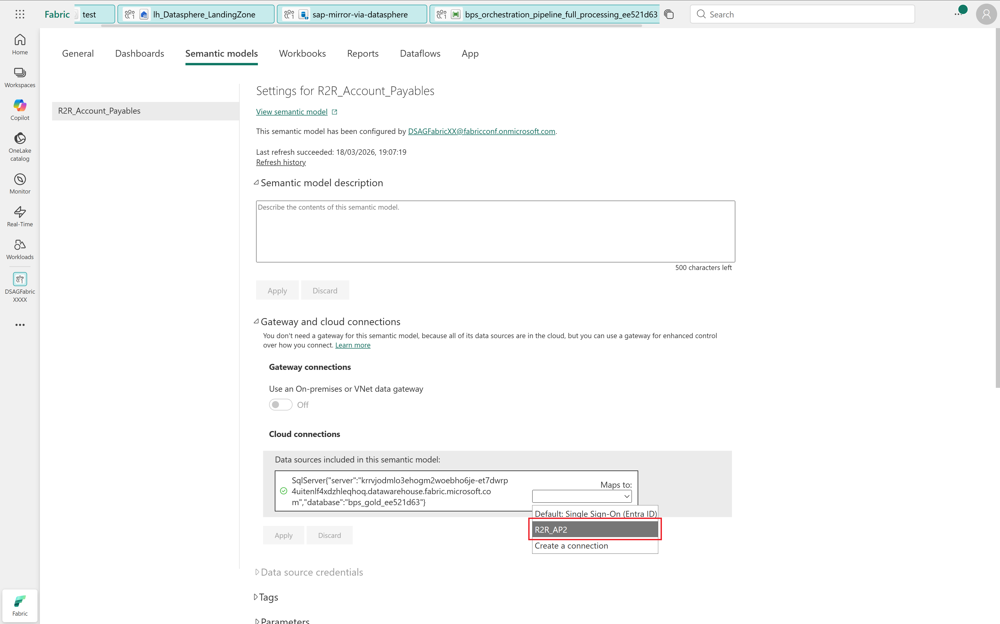
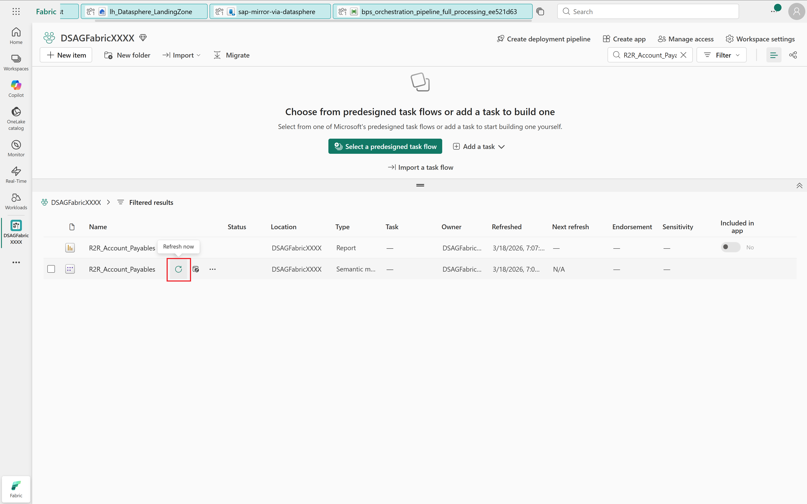
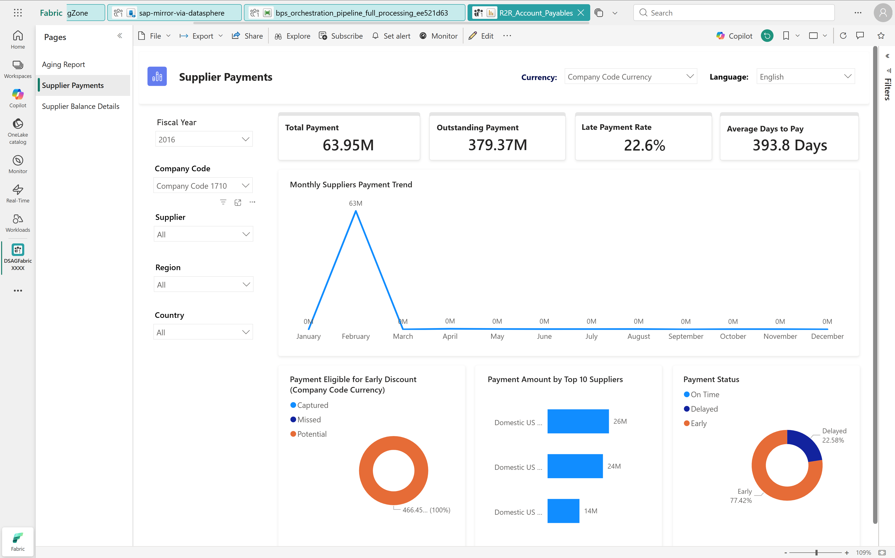

# 🔌 8. Challenge 8: Adjust fact processing
[< 🤖 Quest 7](Quest7.md) - **[🔧 Quest 8 >](Quest8.md)**

## 8.1. Process data from bronze to silver

Our bronze layer contains the raw source data mirrored via SAP Datasphere. Let's populate the silver layer by running the corresponding orchestration pipeline ```bps_om_b2s_orchestration_pipeline_***```.



> [!NOTE]
> The pipeline should take about 15 minutes to run.

## 8.2. Process data from silver to gold

In the gold layer, data is formatted in a way optimized for consupmtion in Power BI. For example, surrogate keys are introduced, and a Power BI semantic model is created on top of the gold layer.
Let's process data from silver to gold by running pipeline ```bps_orchestration_pipeline_full_processing_***```.



> [!NOTE]
> The pipeline should take about 20 minutes to run.

## 8.3. Adjust and refresh semantic model

### 8.3.1. Find the semantic model ```R2R_Account_Payables```.



### 8.3.2. Open settings



### 8.3.3. Open "Gateway and cloud connection" settings

Select "Create a connection".



### 8.3.4. Create connection

Assign a connection name. Select "OAuth 2.0" as authentication method and click "Edit credentials".



### 8.3.5. Authenticate and create

Follow the OAuth flow and click "Create" to create the connection.



### 8.3.6. Map semantic model to connection

Map the semantic model to the newly created connection.



### 8.3.7. Refresh the semantic model

Back in your workspace, refresh the semantic model.



## 8.4. Launch Power BI report



# Where to next?

**[🤖 Quest 7](Quest7.md) - [🔧 Quest 8 >](Quest8.md)

[🔝](#)
