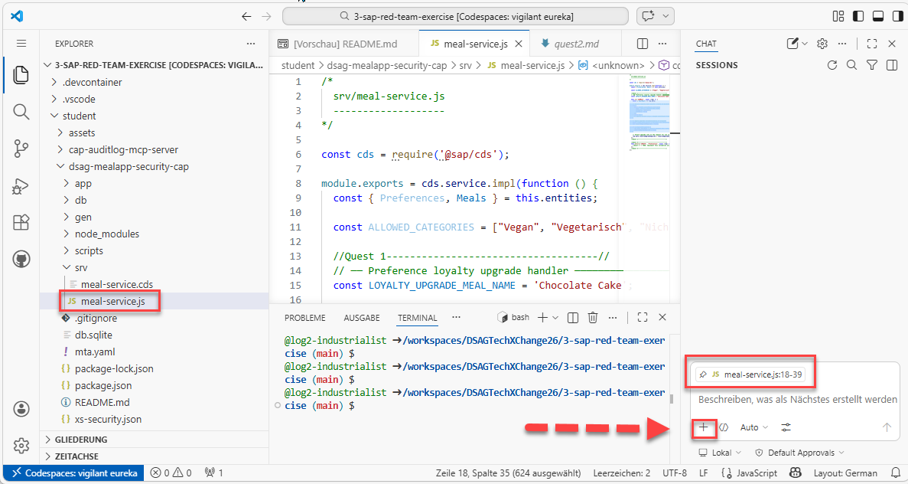
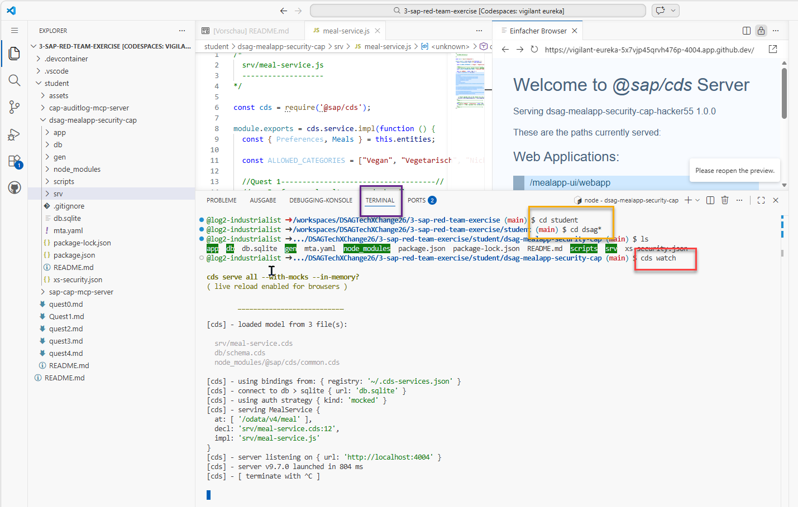
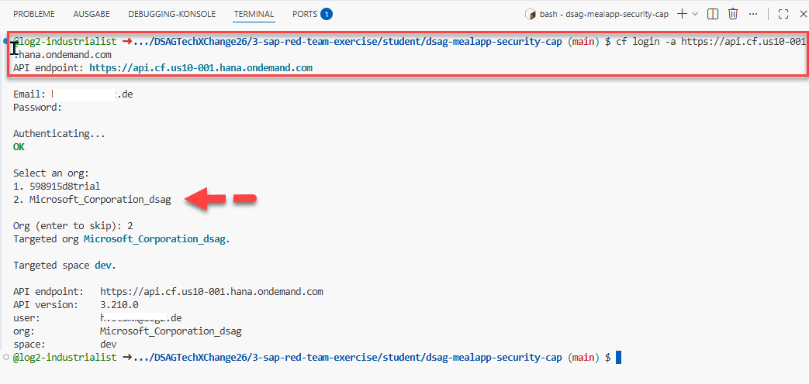
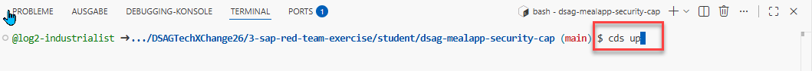

# Quest 1 - Compromise the SAP CAP app using MCP (red team)

**[🏠Home](README.md)** - [ Quest 2 >](quest2.md)

The SAP BTP developer found this amazing SAP CAP MCP server to speed up the work and meet the aggressive delivery timeline. Lunch is around the corner as you know! Since the developer is wary of external libraries he hastly copied the mcp server project, that the red team lured him to use, locally in his environment. God knows what it would do running somewhere else. Better be safe than sorry!

## Developer Backlog for the DSAG lunch app

- Add option to add new meals via API (SAPUI5 UI already done by another team)
- Dishes to be added: healthy Salad bowl, and tasty Smash-burger.
- Do rough testing and ship immediately!

## Put the AI to work! Time is of the essence!

- Make sure you have the backend service file [meal-service.js](dsag-mealapp-security-cap/srv/meal-service.js) open that GPT-5 mini helped you discover before.
- Move into the GitHub Copilot Chat window and pin the js file using the `+` button to set the AI context to that file primarily.
<p align="center" width="100%">

</p>

- Ensure you are set to Agent mode from the options menue underneath.
- Make sure that your shiny new SAP CAP MCP server that is coming to your rescue is operational. 
- Use Ctrl+Shift+P and type `mcp: List Servers`.
- If the `sap-cap-food-advisor is not running` fire it up.
- Now, ask your AI assistant:
    
```text
Use your available mcp tools and create a SAP CAP action called addMeal. 
The action should accept mealName, category and chefOnly as boolean. 
Make sure to follow the mcp tool recommendations exactly.
```
- Spot the MCP tool choice in the AI chat window and approve the action `get-sap-cap-recommendation`. 
Watch the magic happen.

Congratulations, you just created a new API endpoint in record time without writing a single line of code! You might actually make that ridicoulus release timeline after all.

## Without further ado go and test your new function!

- Run `cds watch` if not still running (usually it auto-updates on the fly when code changes arrive)
<p align="center" width="100%">

</p>

- Use credentials: `dummy@dsag.de` / `Start123!` to log in to the app.
- Open the admin view of the DSAG lunch app from the button at the top right
- Add the first healthy dish from the backlog work item and hit save.
- Did the AI generated app work? Then go ahead and deploy to production like a boss.

## Deploy your SAP CAP app to BTP

- Run `cf login -a https://api.cf.us10-001.hana.ondemand.com`. Use your credentials.
- Pick the org `Microsoft_Corporation_dsag` and the space `dev`.
<p align="center" width="100%">

</p>
  
- Run `cds up` and have a look at the next quest while the app deploys - that takes a couple minutes.
<p align="center" width="100%">

</p>
  
## Update the [leaderboard](https://martinpankraz.github.io/crispy-potato/) with your progress⏱

Next, we will switch to the defender's perspective - the **blue team** - and learn how to detect and prevent such attacks.

## Where to next?

**[🏠Home](README.md)** - [ Quest 2 >](quest2.md)

[🔝](#)
