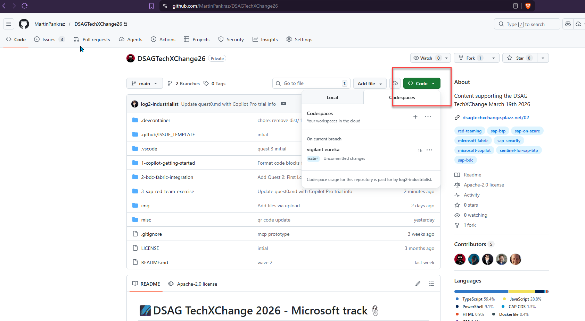
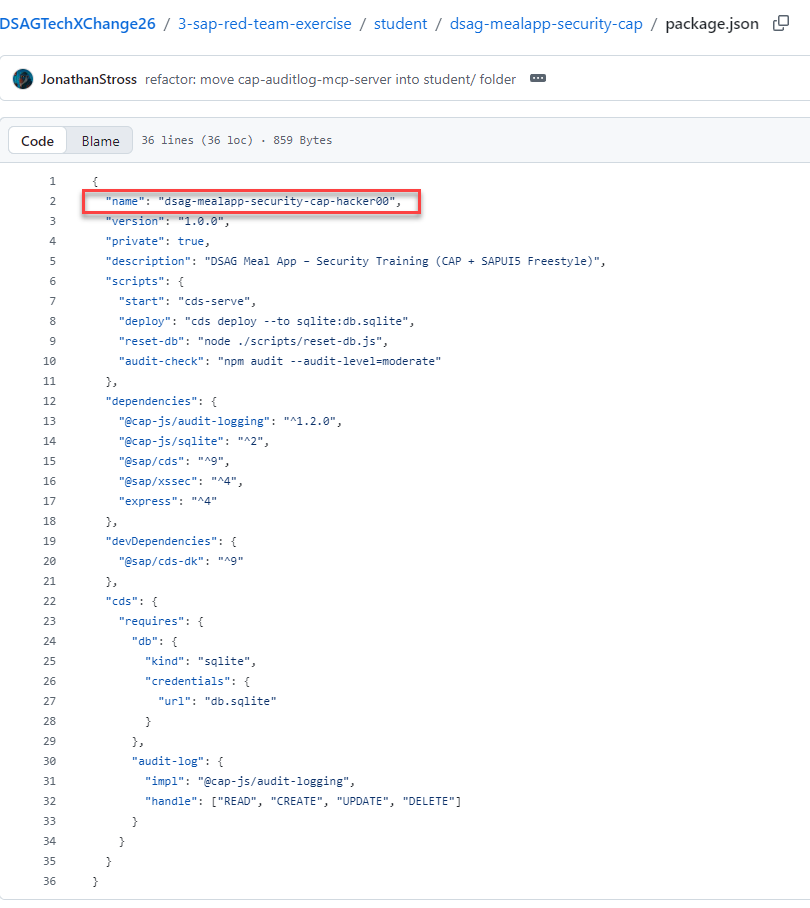
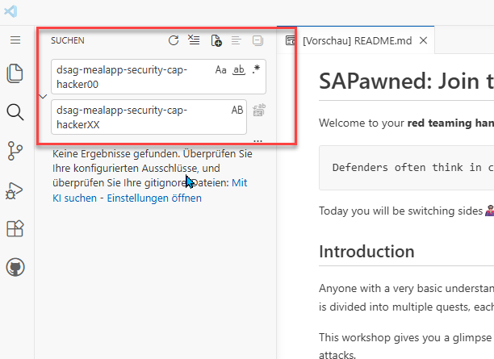
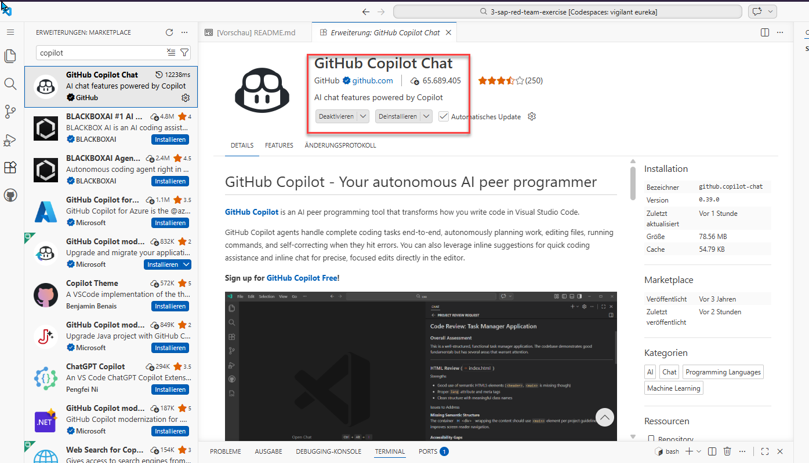
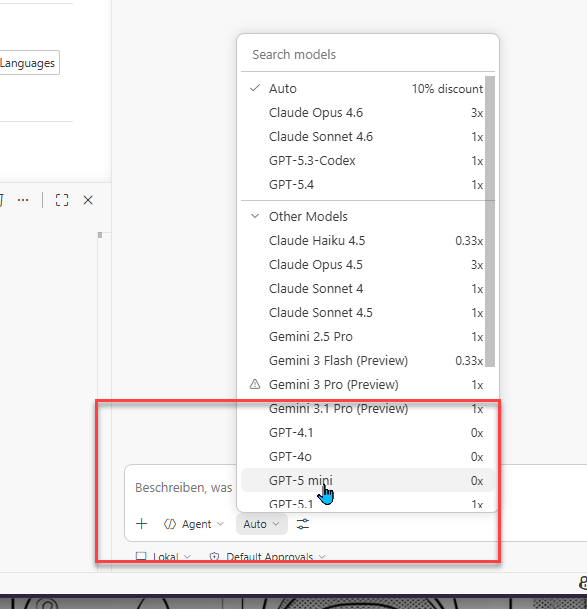

# Quest 0 - Meet the AI and Setup your lab environment

**[🏠Home](README.md)** - [ Quest 1 >](Quest1.md)

The popular full day SAP hackathon event DSAG TechXChange desperately needs a Lunch order processing app at veeery short notice! Just the right event for the red team to take action.

Every dev out there feels the pressure to deliver faster and faster, and AI is the way to go. All of us know what happens next... 

Things start to fall through the cracks, and security is the first victim. In this quest, we will set up a lab environment that will allow us to experience this first hand.

## Gather your logins and tools

If you recall the pre-requisites mentioned in the [README](README.md#Lab-prerequisites), now is the time to get them ready. You will need:

### Share account info with your coaches

- SAP BTP account email. Don't have an SAP P-User or similar assigned yet to your email? -> [here you go](https://community.sap.com/t5/technology-blog-posts-by-members/creating-a-p-user-in-sap-cloud-platform-to-practise-sap-hana/ba-p/13459295).
- Microsoft Account: This will be shared with your by the coaches. But you need a mobile phone with Microsoft Authenticator app installed and ability to link to that Account to be able to log in. MFA is enforced, therefore this step is mandatory.

### Have ready at hand

- GitHub account. If you don't have one, create a free account [here](https://github.com/signup).

> [!WARNING]
> GitHub Copilot free tier has limits (50 messages + 2000 chat completions)! See the latest info [here](https://docs.github.com/en/copilot/concepts/billing/individual-plans#github-copilot-free). Use your messages wisely in the quests.

> If there is an urgent need for extra credits, you can start a 30-Day free trial on Copilot Pro

Now, start your engines...

## GitHub Codespaces Setup

For this quest, a minimal GitHub Codespaces dev container is included at [`.devcontainer`](../\.devcontainer/devcontainer.json).
Here is the location to start github codespaces
<p align="center" width="100%">

</p>
1. Open a free Codespace directly on [this repository](https://github.com/codespaces/new?hide_repo_select=true&ref=main&repo=1113851593&skip_quickstart=true)
<p>
2. Wait for container bootstrap to finish (npm dependencies for SAP CAP + MCP server, plus CAP/CF/MBT tooling)
</p>
<p>
3. Rename the sap cap app. 
<p>
<p align="center" width="100%">

</p>

> [!IMPORTANT]
> Put your user number as prefix (e.g. `hacker01`). This is important to avoid conflicts with other red teamers in the same BTP subaccount. Use the codespace search and replace functionality (Ctrl+Shift+H) to do this quickly <b>across all files</b>. 
> Search for `dsag-mealapp-security-cap-hacker00` and replace with `dsag-mealapp-security-cap-hackerXX` (where XX is your user number).

<p align="center" width="100%">

</p>

4. See the GitHub Copilot flyout to the right of your code editor. If you don't see it, open the command palette (Ctrl+Shift+P) and search for ">GitHub Copilot:" to open it manually.
<p align="center" width="100%">

</p>
5. 
    - Pick AI Model `GPT-5 mini`. This is very important! Otherwise, you won't get the same experience as described in the quests.
<p align="center" width="100%">

</p>
<p>
    - Meet your AI assistant and ask it: "show me in which javascript file the first quest starts." Keep your urge to play more at bay and continue for now. We will get there ;-)
</p>    
5. Test the provided SAP CAP app using below commands in the terminal:

```bash
cd student/dsag-mealapp-security-cap
cds watch
```

So far, so good. Now, let's see what happens when we ask our AI assistant to "help us ship this Lunch Order app faster". Don't worry, we won't let AI loose in the kitchen poisoning everyone... or will we?

> [!NOTE]
> In case you can't leverage GitHub Codespaces and Copilot for any reason, you can also set up a local development environment on your machine. Install from [here](https://code.visualstudio.com/download). Often your coaches will have pre-configured virtual machines ready for you with everything installed and ready to go.

## Where to next?

**[🏠Home](README.md)** - [ Quest 1 >](Quest1.md)

[🔝](#)
