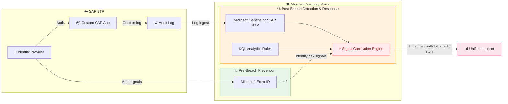

# Quest 2 - Analyze the catch with SAP Audit Log Viewer and Microsoft Sentinel for SAP BTP (blue team)

[< Quest 1 ](Quest1.md) - **[🏠Home](README.md)** - [ Quest 3 >](quest3.md)

## Picking up from the previous quest

Is your app deployed and operational by now? Have a look at the Cloud Foundry log output in your terminal and see the status on BTP itself [here](https://emea.cockpit.btp.cloud.sap/cockpit/#/globalaccount/CA162194TID000000000741164365/subaccount/57070a8b-c114-4ce2-bc75-c96442195f67/org/45498321-09fe-4090-a061-5dbf1d3cbd23/space/2d8f082e-cda6-4315-9ff7-49f75a212ec8/applications).

- Use your approuter URL (mapped routes section) to log in to the app with the credentials `dummy@dsag.de` / `Start123!`.
- Add the new meal via the admin view again, but this time for real.

You, as the red teamer lured a SAP BTP developer to upgrade the SAP CAP application ;-) by creating a new API endpoint with susprising outcome using the SAP CAP MCP server and an AI assistant. 

## Welcome back, blue team defender!

At this stage the only thing defenders can do for post-breach scenarios, is to monitor SAP BTP's standard built-in audit log. Looking at walls of text is no fun and not efficient though.

Do it anyways to know what you are in for.

## See the SAP Audit Log Viewer in action

- Login on BTP [here](https://emea.cockpit.btp.cloud.sap/cockpit/#/globalaccount/CA162194TID000000000741164365/subaccount/57070a8b-c114-4ce2-bc75-c96442195f67/service-instances&//?layout=OneColumn&section=overview).
- Open the SAP Audit Log Viewer from the SAP BTP subaccount and try to find your logged login on the CAP app for a minute.

So, now it's time to analyze what Microsoft Sentinel for SAP BTP caught so far.

> [!NOTE]
> For the next steps Sentinel for SAP BTP must have been set up in your SAP BTP subaccount beforehand. If you are doing this exercise in a guided workshop, your instructor should have taken care of this already. If you are doing this on your own, please follow the instructions in the prerequisites to set up [Sentinel for SAP BTP](https://learn.microsoft.com/azure/sentinel/sap/deploy-sap-btp-solution) to onboard your subaccount.

## Use Microsoft Sentinel for SAP BTP to find the attack pattern

### Inspect visually in the Sentinel for SAP BTP workbook

- Open the Microsoft Sentinel workspace that is connected to your SAP BTP subaccount
- Open the workbook [`SAP BTP Activity`](https://portal.azure.com/?feature.customportal=false#view/Microsoft_Azure_Security_Insights/MainMenuBlade/~/WorkbooksV2/id/%2Fsubscriptions%2F48b193a0-2500-45b5-ad41-f09cde1a95cd%2Fresourcegroups%2Fdsagws-rg%2Fproviders%2Fmicrosoft.securityinsightsarg%2Fsentinel%2Fdsagwstechxchange) and inspect the tab `Custom App Audit Coverage` for your own CAP app signals. What is the audit state of your SAP CAP app?

### Apply KQL to run your own investigation of the login events for your CAP app

- Navigate to the Sentinel for SAP BTP data connector via the Content hub.
- Search for `SAP` in the content hub and open the SAP BTP solution overview.
- Open the [data connector page](https://portal.azure.com/?feature.customportal=false#view/Microsoft_Azure_Security_Insights/ConnectorPage.ReactView/dataConnectorId/SAPBTPAuditEvents/subscriptionId/48b193a0-2500-45b5-ad41-f09cde1a95cd/resourceGroup/dsagws-rg/workspaceName/dsagwstechxchange) and verify log ingest from the graph
- Next use `Go to log analytics` to open the log query editor. Switch from Simple mode to KQL mode if needed
- Run the following query to find the login events for your CAP app:

```kql
SAPBTPAuditLog_CL
| where UserName == "<your username>";
```

Do you see why audit log monitoring alone is not sufficient to detect the attack? Take note that multiple entries are required for a meaningful detection of the attack pattern.

### Discover the built-in analytic rule for "BTP - Unaudited custom app with login-only activity" in Sentinel

- [Browse](https://portal.azure.com/?feature.customportal=false#view/Microsoft_Azure_Security_Insights/MainMenuBlade/~/Analytics/subscriptionId/48b193a0-2500-45b5-ad41-f09cde1a95cd/resourceGroup/dsagws-rg/workspaceName/dsagwstechxchange) the available templates for BTP detections using the tab `Rule Templates`.
- Find the one for `Unaudited custom SAP BTP applications` and open it (use the `...` button and click edit).
- Navigate to `Set rule logic` pane and expand the KQL view. Understand how the rule matches multiple audit events to detect the unaudited apps. Ask an AI to explain in simple terms for convenience.
- Cancel the edit again and move on.

### Check the generated incident and its details

- Browse the [incident overview](https://portal.azure.com/?feature.customportal=false#view/Microsoft_Azure_Security_Insights/MainMenuBlade/~/6/subscriptionId/48b193a0-2500-45b5-ad41-f09cde1a95cd/resourceGroup/dsagws-rg/workspaceName/dsagwstechxchange). Can you identify the incident triggered by your custom SAP CAP app? Search by Title.

Typically defenders would now track internal SAP BTP departments fixing their unaudited apps over time.

## The difference between SAP pre-breach and post-breach threat detection

Both SAP's built-in audit log and Microsoft Sentinel for SAP BTP operate in the **post-breach** space — they detect and respond to threats **after** a compromise has occurred. The critical difference is *how well* they do it. SAP's audit log gives you raw events in a single subaccount. Microsoft Sentinel for SAP BTP elevates post-breach detection through **signal correlation**, **built-in analytic rules**, and **cross-platform incident management**, turning scattered log entries into actionable security incidents.

Pre-breach prevention (stopping attacks before they land) is the domain of **Microsoft Defender for Cloud** and **Microsoft Entra ID**, which protect the identity and infrastructure layers *around* SAP BTP.



### Key takeaways

| Capability | SAP Audit Log alone | + Microsoft Sentinel for SAP BTP | + Defender & Entra ID |
|---|---|---|---|
| **Scope** | Post-breach | Post-breach | Pre-breach |
| **Visibility** | Single app / subaccount | Cross-landscape, cross-cloud | Identity & infrastructure layer |
| **Signal correlation** | Manual log reading | Automatic multi-signal correlation across audit events | Enriches Sentinel incidents with identity risk & threat intel |
| **Analytic rules** | None | Built-in SAP BTP templates (e.g. *Unaudited custom apps*) | Defender recommendations & Entra risk detections |
| **Detection quality** | Raw events, high noise | Correlated incidents, reduced noise | Impossible travel, anomalous tokens, risky sign-ins |
| **Incident response** | Export CSV, read logs | Automated playbooks, investigation graphs, SOAR | Conditional Access, automated blocking |

> [!TIP]
> The real power of Sentinel for SAP BTP lies in **post-breach signal correlation**: a single audit log entry (e.g. a new API endpoint deployment) is noise. But when Sentinel correlates it with a missing audit configuration **and** enriches it with identity risk signals from Entra ID, it becomes a high-fidelity incident — dramatically reducing the time to detect and respond to a compromise.

> [!TIP]
> Use the built-in playbooks to block SAP BTP users or isolate compromised apps immediately upon detection, preventing further damage while you investigate. See this blog for more details: [Automated response with Sentinel for SAP](https://community.sap.com/t5/enterprise-resource-planning-blog-posts-by-members/from-zero-to-hero-security-coverage-with-microsoft-sentinel-for-your/ba-p/13561790).

## Update the [leaderboard](https://martinpankraz.github.io/crispy-potato/) with your progress⏱

Congratulations for completing the mandatory quests! Spread the word to make SAP BTP a safer place.

Just got started!? We got you covered with somore more Blue Team work and AI driven remediation of the compromise! Move on to the optional quest 3.

## Where to next?

[< Quest 1 ](Quest1.md) - **[🏠Home](README.md)** - [ Quest 3 >](quest3.md)

[🔝](#)
