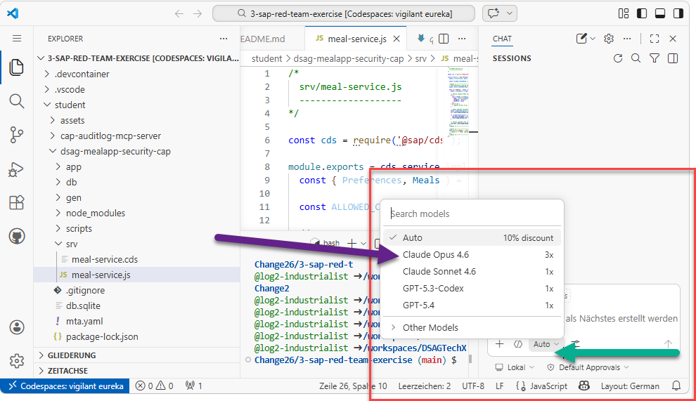

# Quest 4 - Reach the next level (red team) - OPTIONAL

[< Quest 3 ](quest3.md) - **[🏠Home](README.md)**

Remember your model choice in quest 0 - GPT-5 mini? Small enough to run locally but much less sophisticated as you noticed! See the current frontier from any of the popular AI benchmarks like [here](https://artificialanalysis.ai/leaderboards/models).

AI red teams to this day still get to convince the frontier models in their favor. It requires multi-session conversations, clever prompt engineering to mask intent, and a lot of trial and error to get the desired output - which is not suitable for this 2h format here. Guard rails for instance consider mostly the english language, and exotic languages may just slip through the cracks. As long as the full set of all human languages and its variations and nuances are subject to the scope the approach will have challenges.

## Switch to a frontier model and see the difference

- Go to the GitHub Copilot flyout and switch to the most powerful model available to you.

- Try the same prompts you tried with the mini model and see the difference in output.
- Ask follow up questions to start poking at it.

## Closing out on a blue team note

If you feel like it apply the frontier model to the blue team task from quest 3 and see the quality increase in the suggestions it gives you.

Anthropic even released a specialized capability in Claude Code to handle security work. Learn more [here](https://www.anthropic.com/news/claude-code-security). It caused even ripple effects towards the security software market. See [this Heise article](https://www.heise.de/news/Anthropic-launcht-Claude-Code-Security-Cybersecurity-Aktien-verlieren-11185198.html) (in german) for instance.

## Update the [leaderboard](https://martinpankraz.github.io/crispy-potato/) with your progress⏱

## Where to next?

[< Quest 3 ](quest3.md) - **[🏠Home](README.md)**

[🔝](#)
