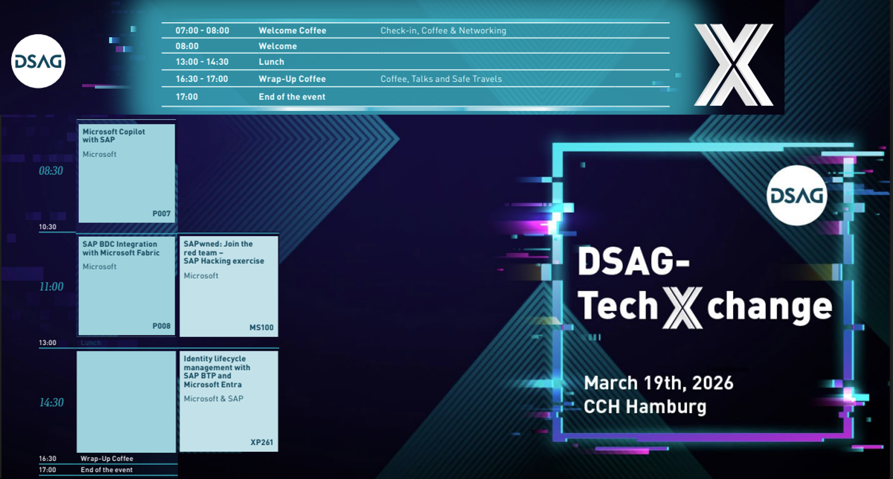

# 🌌DSAG TechXChange 2026 - Microsoft track📎

Welcome to your **SAP with Microsoft hands-on lab** experience! This repos gets you all setup to embark on your assigned epic quest. Excited yet? This is the line up including the lectures taking place on Thursday the [19th of March 2026](https://dsagtechxchange.plazz.net/02):

Find us on-site in Hamburg. We are looking forward to meeting you in person! 🤝

## Introduction

| Lab             | Level | Session Code |Dungeon entry  | Description |
| ---------------- | -------- | -------- | -------- | -------- |
| Microsoft Copilot with SAP | Beginner | P007 | 👉[🏰](./1-copilot-getting-started/README.md) | Learn how to build your first Microsoft Copilot app that interacts with SAP ERP data. |
| SAP BDC integration with Microsoft Fabric | Beginner | P008 | 👉[⛩️](./2-bdc-fabric-integration/README.md) | Learn how to build you first... |
| SAPawned: Join the red team - SAP hacking exercise | Beginner | MS100 | 👉[🧙](./3-sap-red-team-exercise/README.md) | Learn how to ... |
| Identity lifecycle management with SAP BTP and Microsoft Entra | Beginner | XP261 | 👉[🧙](./4-identity-btp-entra/README.md) | Learn how to ... |

## Recommended courses and further learning

* [AI-For-Beginners](https://microsoft.github.io/AI-For-Beginners/)

## 📢Feedback

This repos encourages contributions and feedback via the [GitHub Issues](https://github.com/MartinPankraz/DSAGTechXChange26/issues/new/choose).

## 🚸 Your Adventure Guides

| Name             | Company  |
| ---------------- | -------- |
| [Holger Bruchelt](https://www.linkedin.com/in/holger-bruchelt/)  | Microsoft |
| [Martin Raepple](https://www.linkedin.com/in/martinraepple/)   | Microsoft |
| [Martin Pankraz](https://www.linkedin.com/in/martin-pankraz/)   | Microsoft |
